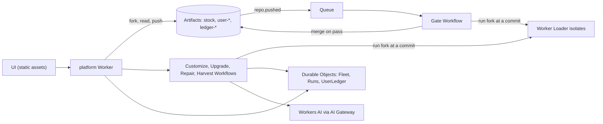

# Fluid

Personal software for academic medicine, built on Cloudflare Workers and Artifacts.

Fluid is an assistant for people who change roles many times a day: clinician, researcher, administrator. The same dosing question gets a different correct answer in each role, so Fluid detects the role, shows why, and lets the user override it. Every user gets their own fork of the assistant, and agents customize, gate, upgrade, and repair those forks in parallel.

This is an entry to Cloudflare's "Build the next Git platform" competition.

Live demo: https://fluid.renato83.workers.dev (synthetic data only). To deploy your own copy, see [docs/DEPLOY.md](docs/DEPLOY.md).

## Three proposals

1. **A fork per person.** A central team ships a stock release. Each user gets an Artifacts repository forked from a stock tag and changes it freely with their own agent.
2. **Intent as version-controlled data.** Every change carries a build-time record of why it exists (`.intent/<id>.json`, linked by an `Intent-Id:` commit trailer). Every answer carries a run-time record of the role, the signals, any override, and the exact fork commit and stock tag.
3. **Behavioral regression against upstream as the merge criterion.** A change merges, and a fork upgrades, only when it passes the stock invariants and functional tests read from stock at the pinned tag, plus the user's own tests. A fork cannot edit or skip the floor.

## Architecture

One control plane Worker (`platform/`) serves the UI and the API. Stock and every fork live as Artifacts repositories in one US-jurisdiction namespace. Each fork's code runs on demand in its own Worker Loader isolate, at any branch or commit. Pushes arrive as Artifacts events on a Queue and start a gate Workflow. The gate runs the three test tiers and fast-forwards main on a pass. The change then runs yellow under a stock end-to-end suite until three clean passes turn it green; a failure rolls main back. Other Workflows run the customize, upgrade, repair, and harvest agents. Durable Objects hold the fleet state, the run timelines, and each user's run-time ledger. Models run on Workers AI behind AI Gateway, but every safety rule is plain code. Details: [docs/ARCHITECTURE.md](docs/ARCHITECTURE.md).



## How concurrency shows up

- Each user's customization agent works in its own fork, at the same time as every other user's.
- One stock release fans out one upgrade Workflow per fork. Each upgrade merges the new tag, runs a merge agent on conflicts, and gates the result.
- Every push starts its own gate. Every failed gate starts its own repair agent.
- In local testing, one release upgraded 202 forks in 159 seconds, with up to 110 forks upgrading or gating at once. 193 passed (39 after the merge agent resolved a conflict) and 9 stayed pinned with repair branches open.
- The fleet view streams every status change live.

## Quick start (local)

You need Node 22.18 or later, a Cloudflare account with Workers Paid and Artifacts access, and the setup in [docs/DEPLOY.md](docs/DEPLOY.md) (namespace and AI Gateway). Local dev uses the real Artifacts and Workers AI.

```sh
git clone <this repo> fluid && cd fluid
(cd stock && npm install && npm test && npm run build)
cd platform && npm install && npm test
npx cf auth login
```

Then start the dev server as shown in [docs/DEPLOY.md, Local development](docs/DEPLOY.md#local-development) and open `http://localhost:5173`.

To look at the UI with no account at all, serve `platform/public/` and open `/?mock=1`. Mock mode answers with the real stock engine in the browser. See [docs/UI.md](docs/UI.md).

## Docs

- [docs/DEPLOY.md](docs/DEPLOY.md): deploy to your own account, local development, cleanup.
- [docs/ARCHITECTURE.md](docs/ARCHITECTURE.md): spec concepts mapped to code and Cloudflare primitives, deviations, safety model.
- [docs/DEMO_SCRIPT.md](docs/DEMO_SCRIPT.md): the video script.
- [docs/GATE_AND_AGENTS.md](docs/GATE_AND_AGENTS.md): workflows, gate integrity, merge rules, events.
- [docs/UI.md](docs/UI.md): UI notes and mock mode.
- [docs/API.md](docs/API.md): shared contracts, HTTP routes, limits.
- [docs/SPIKE_FINDINGS.md](docs/SPIKE_FINDINGS.md): measured behavior of each primitive.
- [docs/Fluid_ Personal Software for Academic Medicine.md](<docs/Fluid_ Personal Software for Academic Medicine.md>): the original spec.
- [stock/README.md](stock/README.md): the stock release and its runtime contract.

## Synthetic data and safety

Every patient, person, drug (Morphinex, Hydrolane), dose, price, policy, and guideline in this repository is fictional. No protected health information enters the system. Fluid is a research prototype. Do not use it for patient care. A real deployment would need a business associate agreement, institutional review, and regulatory review of clinical mode.

## License

MIT. See [LICENSE](LICENSE).
