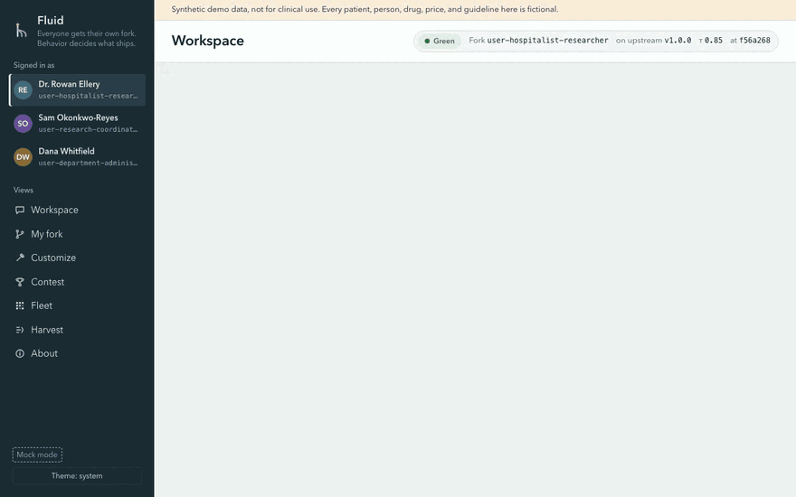
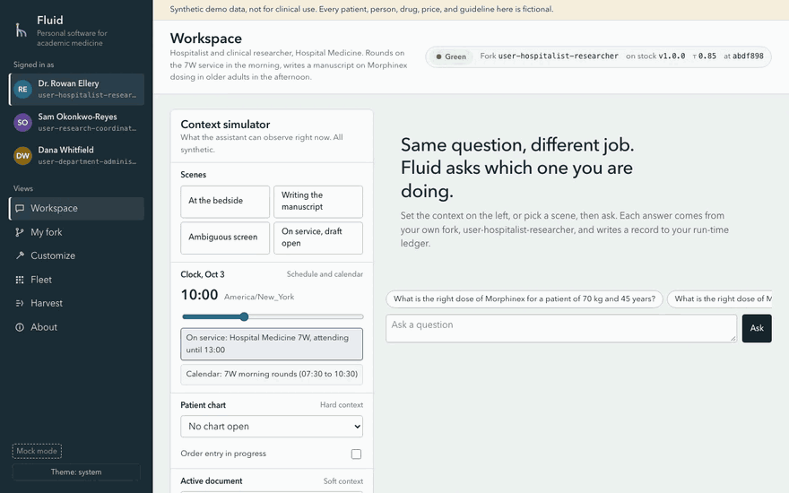
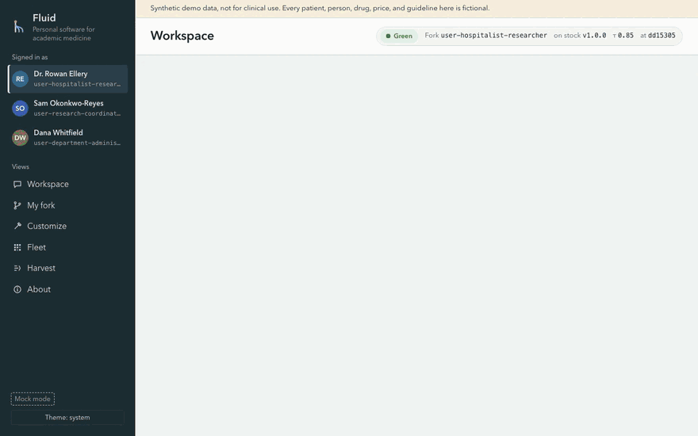
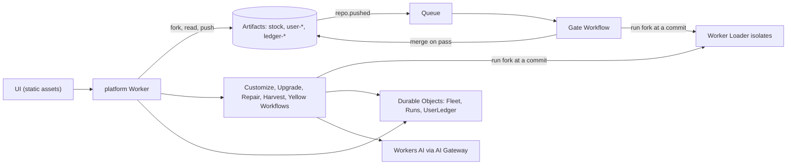

# Fluid

**Everyone gets their own fork. Behavior decides what ships.**

Fluid gives every user a git fork of the software they use, and lets them and any agent reshape it. A change reaches the user's `main` only when it behaves: upstream's tests pass, the user's own tests pass, and a live soak stays clean. It runs on Cloudflare Workers and Artifacts, and every commit of every fork is runnable as soon as it is pushed.

This is an entry to Cloudflare's "Build the next Git platform" competition. Live demo: https://fluid.frontier-software.workers.dev (synthetic data only). To deploy your own copy, see [docs/DEPLOY.md](docs/DEPLOY.md). For the platform in one page, see [docs/OVERVIEW.md](docs/OVERVIEW.md).

## Four ideas

A central team ships upstream (the stock release) as tagged versions of one Artifacts repository. Every user forks upstream. In this README a **wish** is one change plus its intent record, and its **proof** is the tests that check it.

### 1. Behavior is the merge rule

Upstream's tests are the floor. A push to a fork's work branch starts a gate with three tiers. Tiers 1 and 2 are invariants and functional tests that upstream owns. The gate reads them from upstream at the fork's pinned release, so a fork cannot edit or skip them. Tier 3 is the user's own tests. On a pass, `main` fast-forwards to the gated commit and the change goes live in yellow. An upstream-owned end-to-end suite then runs against the live fork (or a basic platform suite, when the pinned release has none). Three clean passes turn it green. A failure rolls `main` back with a revert commit and opens a repair.

Personalization only moves toward safety:

- Users may raise the confidence threshold. The floor rejects any value below upstream's minimum.
- A fork's pin only moves forward. A change that pins an older release cannot merge.
- After a safety release's 14-day grace period, upstream answers for a fork that has not taken it yet.

**Contest: behavior also picks between agents.** Several agents can compete to grant one wish. In **Contest** (or with "Run as a contest" in **Customize**), the recipe when one matches, one or two model plans with different instructions and temperatures, and optionally your own agent through your inbox each build the change on their own branch, `work/contest-<id>-<label>`, with its intent record and its suggested tests. Each is gated in check mode, and the platform keeps the fork's answer to every probe the gate runs. A behavior diff against `main` replaces the pull request: rows are probes, columns are `main` and each candidate, and changed answers are marked field by field. A fixed rule picks the winner and says why: every tier and every wish test passed, then fewest behavior changes outside the wish, then fewest files changed, then finished first. You ship the winner or another contestant that passed. Only that one is gated in merge mode, and it lands through the normal fast-forward, yellow soak, and rollback. The others stay as branches, with a note saying why they lost. A contest of N counts as N customizations. Try it in mock mode: `/?mock=1#contest`. Details: [docs/GATE_AND_AGENTS.md](docs/GATE_AND_AGENTS.md#contest).



### 2. Living forks

Each fork is a git repository that keeps changing. Its owner reshapes it in plain words through the customize agent, or with their own agent over plain git through a per-fork inbox (below). Look and layout are data: a fork writes `ui/preferences.json`, the platform validates it against a fixed schema, and no fork code runs in the browser.

Releases arrive by intent replay. When every wish in a fork came from a recipe, the upgrade rebuilds the fork from the new release and grants each wish again on fresh code. Otherwise it merges the release, and a merge agent resolves conflicts. Either way the gate decides. Harvest is opt-in: it clusters similar wishes across forks and drafts them as a `harvest/<slug>` branch in upstream for maintainers to review.

### 3. Git is the audit log for what software says

Every change records why it exists in `.intent/<id>.json`, linked by an `Intent-Id:` commit trailer. Every answer writes a run-time record with the fork commit and the upstream tag that produced it. These records collect in a per-user Durable Object and are committed daily to a git repo, `ledger-<id>`. The soak tests that link: an upstream scenario checks that a new record's `fork_commit` equals the live commit. An admin-only test recipe that breaks `fork_commit` passes tiers 1 to 3, and the soak rolls it back.

### 4. Every commit runs, and the sandbox enforces ownership

The platform loads any fork at any branch or commit into a Worker Loader isolate keyed by repo and sha. There is no build queue. In local testing, more than 100 forks upgraded or gated at once. Fork isolates have no network. The gate's test runner runs in a second isolate built only from upstream files. The two isolates do not trust each other and meet only through one `ask` RPC. The soak's runner reaches the live fork through a small set of platform calls.

## How Fluid answers the brief

- **How do agents know what other agents are working on?** Every agent run writes a timeline to a `Runs` Durable Object, and the `Fleet` Durable Object streams every fork's status live. Each commit an agent makes carries an intent record, so any agent can read what a branch is for. `GET /api/forks/:repo/wishes` lists every wish in flight in a fork: each `work/*` branch with the record it adds and its status, plus customize and contest runs that have not pushed yet.
- **How do you keep track of why?** In git. Intent records live in the fork next to the code they explain. The run-time ledger links each answer to the exact fork commit and upstream tag.
- **What about conflicting changes?** `main` only fast-forwards to a gated commit. When two changes race, the first to pass lands. The other merges the new `main` into its branch and is gated again, or stops on a real conflict. On a release, replay sets each wish again on the new files, which avoids many text conflicts.
- **How do you compare multiple changes and decide which ships?** With a contest: several agents work on one wish, each is gated in check mode, a behavior diff against `main` shows what each one changed in the answers, and a fixed rule picks the winner. Only the one you ship is gated in merge mode. Harvest compares wishes across forks and drafts the common ones for upstream review.

Shipped in v2.0-beta: Contest and the list of wishes in flight. Their limits, stated plainly: the contest workflow ran end to end on the live site on 2026-10-06 (three model plans, all passed, the pick went through the merge gate and turned green), but that is one run; model plans for a recipe request often produce no change (a model plan may not edit `fluid.toml`); a change that alters no probe's answer ties on behavior and is decided by files changed and time; the mock contest plays one fixed scenario whatever the wish.

## Proving ground: academic medicine

We picked the domain where a wrong merge can hurt someone. If behavior-gated forks are safe enough for a dosing question, they are safe enough for your expense tool.

The demo app is an assistant for people who change roles many times a day: clinician, researcher, administrator. The same dosing question has a different correct answer in each role. Fluid detects the role, shows why, and lets the user override it. Try it live at https://fluid.frontier-software.workers.dev.



In mock mode (`/?mock=1`), Dr. Rowan Ellery asks the same dosing question at the bedside, attests to see the research answer, asks again while writing a manuscript, and gets labeled answers on an ambiguous screen.



The second demo customizes the fork in plain words: a crimson look, a Windows XP look, and a page of charts. Each change is written to `ui/preferences.json`, gated, and merged. See [docs/UI.md](docs/UI.md).

## Bring your own agent

In **My fork**, **Connect your own agent** gets a write token valid for one hour (`POST /api/forks/:repo/token`). The token writes only to your inbox, `inbox-user-<id>`, a separate copy of your fork:

```sh
git clone https://x:<token>@<account>.artifacts.cloudflare.net/git/fluid/inbox-user-<id>.git inbox-user-<id>
cd inbox-user-<id>
git checkout -b work/my-change
git add -A && git commit -m "Describe the change"
git push origin work/my-change
```

The platform imports each new `work/<name>` head into your fork as `work/inbox/<name>`, within caps (10 imports an hour, 50 commits, 200 files, 1 MB per file, 8 MB to download). The gate then decides, as for changes made in the app. Other refs in the inbox are ignored. If your branch adds no `.intent/<id>.json`, the gate drafts one from your commit messages and files. A failed gate opens no repair for an imported change, so fix it in your agent and push again. Each new token replaces the inbox with a fresh copy of your `main`. The inbox is deleted 15 minutes after its token expires. Details: [docs/GATE_AND_AGENTS.md](docs/GATE_AND_AGENTS.md#outside-pushes).

## Intent replay

A Fluid fork is a list of wishes and the proofs for them. On every release we grant your wishes again on fresh code. When every wish came from a recipe (a tau change, a look or chart tab, a REDCap connector, the seeded plain wording), the upgrade rebuilds the fork from the new tag, one commit per wish. It gates the result with all tiers, including your own tests, and shows "N of N wishes carried to vX". A fork with a model-written change takes the merge path, and so does a replay that fails its gate. Try it in mock mode: Fleet, then "Tag release and upgrade the fleet". Details: [docs/GATE_AND_AGENTS.md](docs/GATE_AND_AGENTS.md#intent-replay).

## Architecture

One control plane Worker (`platform/`) serves the UI and the API. Upstream and every fork live as Artifacts repositories in one US-jurisdiction namespace. Pushes arrive as Artifacts events on a Queue and start a gate Workflow. Other Workflows run the customize, upgrade, repair, harvest, and yellow soak agents. Durable Objects hold the fleet state, the run timelines, and each user's ledger. Models run on Workers AI behind AI Gateway, and every safety rule is plain code. Details: [docs/ARCHITECTURE.md](docs/ARCHITECTURE.md).



Concurrency in practice:

- Each user's agent works in its own fork, at the same time as every other user's.
- One release starts one upgrade Workflow per fork, and every push and every failed gate starts its own gate or repair.
- In local testing, one release upgraded 202 forks in 159 seconds, with up to 110 forks upgrading or gating at once (measured before intent replay).
- The fleet view streams every status change live.

## Quick start (local)

You need Node 22.18 or later, a Cloudflare account with Workers Paid and Artifacts access, and the setup in [docs/DEPLOY.md](docs/DEPLOY.md) (namespace and AI Gateway). Local dev uses the real Artifacts and Workers AI.

```sh
git clone https://github.com/renato-umeton/fluid && cd fluid
(cd stock && npm install && npm test && npm run build)
cd platform && npm install && npm test
npx cf auth login
```

Then start the dev server as shown in [docs/DEPLOY.md, Local development](docs/DEPLOY.md#local-development) and open `http://localhost:5173`.

To look at the UI with no account, serve `platform/public/` and open `/?mock=1`. Mock mode answers with the real upstream engine in the browser. See [docs/UI.md](docs/UI.md).

## Docs

- [docs/OVERVIEW.md](docs/OVERVIEW.md): the platform in one page, for any domain, and what is still medical-specific.
- [docs/ARCHITECTURE.md](docs/ARCHITECTURE.md): concepts mapped to code and Cloudflare primitives, deviations, safety model.
- [docs/GATE_AND_AGENTS.md](docs/GATE_AND_AGENTS.md): workflows, gate integrity, merge rules, replay, the yellow soak, events.
- [docs/DEPLOY.md](docs/DEPLOY.md): deploy to your own account, local development, cleanup.
- [docs/API.md](docs/API.md): shared contracts, HTTP routes, limits.
- [docs/UI.md](docs/UI.md): UI notes and mock mode.
- [docs/DEMO_SCRIPT.md](docs/DEMO_SCRIPT.md): the video script.
- [docs/SPIKE_FINDINGS.md](docs/SPIKE_FINDINGS.md): measured behavior of each primitive.
- [docs/Fluid_ Personal Software for Academic Medicine.md](<docs/Fluid_ Personal Software for Academic Medicine.md>): the original medical case study spec.
- [stock/README.md](stock/README.md): the upstream release and its runtime contract.

## Synthetic data and safety

Every patient, person, drug (Morphinex, Hydrolane), dose, price, policy, and guideline in this repository is fictional. No protected health information enters the system. Fluid is a research prototype. Do not use it for patient care. A real deployment would need a business associate agreement, institutional review, and regulatory review of clinical mode.

## License

MIT. See [LICENSE](LICENSE).
