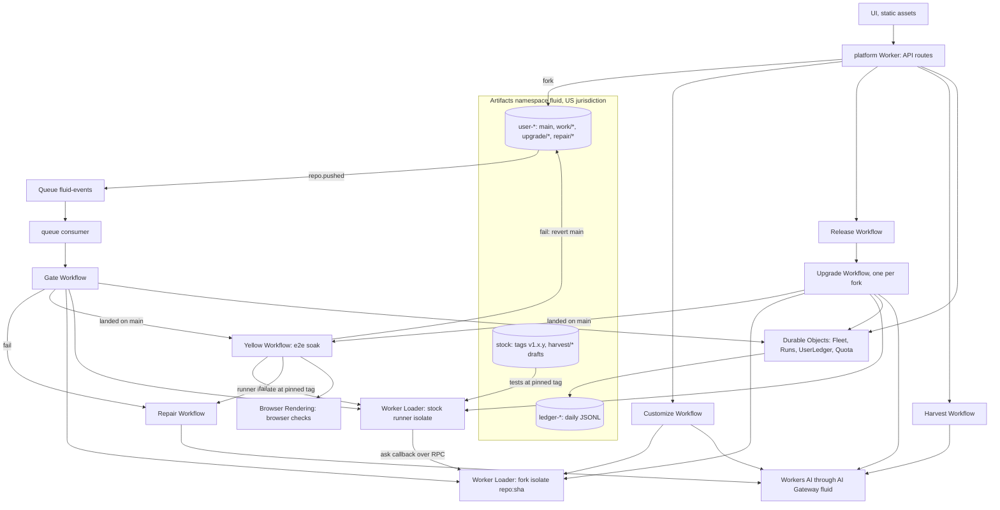

# Fluid architecture

This document maps each concept in the spec (`docs/Fluid_ Personal Software for Academic Medicine.md`) to the code and to the Cloudflare primitive behind it. It also lists where the build differs from the spec, and why, and it describes the safety model.

Related documents: `docs/GATE_AND_AGENTS.md` (workflows and gate details), `docs/SPIKE_FINDINGS.md` (measured behavior of each primitive), `stock/README.md` (the stock runtime contract), `docs/UI.md`.

## Repository layout

| Path | What it is |
| :-- | :-- |
| `stock/` | Source of the mothership `stock` repository. It is published to Artifacts and tagged. |
| `platform/` | The control plane: one Worker that serves the UI and the API and runs every agent. |
| `platform/public/` | The UI. Static HTML, CSS, and ES modules with no build step. |
| `synthetic/` | Synthetic patients, call schedule, calendars, documents, formulary, REDCap export, and personas. |

## The pieces at a glance

## Spec concepts mapped to code and primitives

### Mothership and stock releases (spec 3)

- **Code.** `stock/` holds the runtime (`app/`), the intent engine (`intent/`), the per-mode policies and the US source registry (`policies/`), the connectors (`connectors/`), the invariant and functional suites (`tests/invariants/manifest.json`, `tests/functional/manifest.json`), the probe runner (`tests/runner.ts`), the build-time intent ledger (`.intent/`), and `fluid.toml`.
- **Publishing.** `platform/scripts/bundle-content.mjs` bundles stock from git `HEAD` into `platform/src/generated/stock-source.json`. `platform/src/stock/publish.ts` commits it to the `stock` repo with isomorphic-git, tags it, and writes `releases/<tag>.json` (notes, safety flag, date, grace period). Route: `POST /api/admin/stock/publish`.
- **Demo release.** `POST /api/admin/release` builds the next tag from the latest stock content (`demoReleaseFiles` in `platform/src/stock/releases.ts`). The demo release tightens an invariant, so forks whose customizations relied on the looser rule fail the gate at the new tag. It also changes one line of card wording, so forks that customized the same line conflict on purpose and exercise the merge agent.
- **Primitive.** Artifacts repository `stock`. Releases are annotated git tags.

### A fork per person (spec 3, 4.1, 4.2)

- **Code.** `platform/src/forks/provision.ts` (`provisionFork`). It forks `stock` into `user-<id>` with the Artifacts binding, then commits the onboarding change on `main`: `fluid.toml` keeps the stock values plus the user's preferences, and a build-time intent record explains the change.
- **Sessions.** `POST /api/session` issues a signed cookie (`platform/src/lib/session.ts`) for a persona. Each visitor gets a sandbox user id, so public visitors never share forks. Provisioning claims are atomic in `Fleet.claimProvisioning`.
- **Primitive.** Artifacts binding: `create`, `get`, `fork`, `readFile`, `log`, `readTree`, `createToken`. All binding calls use short refs or SHAs (`platform/src/runtime/refs.ts`), because `refs/...` names return null.

### Per-fork runtime

- **Code.** `platform/src/runtime/loader.ts` reads a fork's runtime files (`app/`, `intent/`, `policies/`, `connectors/`) at a branch, tag, or SHA, strips TypeScript types with sucrase (`platform/src/runtime/modules.ts`), and loads them into a Worker Loader isolate keyed `<repo>:<sha>`. A generated `Fork` entrypoint exposes `ask()` over RPC.
- **Isolation.** The isolate has `globalOutbound: null`, so it has no network. Synthetic data is passed in as `env.data`. Only the model variant (`:llm`) gets the `LLM` capability (`platform/src/runtime/llm-host.ts`).
- **Primitive.** Worker Loader (Dynamic Workers). Every branch and commit is live as soon as it is pushed.

### The gate (spec 4.3, 6)

- **Trigger.** An account-level Artifacts event subscription sends `repo.pushed` to the queue `fluid-events` (created by `platform/scripts/setup-events.mjs`). The queue consumer (`platform/src/events/consumer.ts`, filter in `platform/src/events/filter.ts`) keeps pushes to `user-*` work branches in namespace `fluid` and starts a `GateWorkflow` instance. Instance ids come from (repo, branch, commit), so a push is gated once.
- **Code.** `platform/src/workflows/gate.ts` and `platform/src/gate/run.ts`.
  1. Read `fluid.toml` at the pushed commit to find the pinned stock tag.
  2. Read the invariant and functional manifests and `tests/runner.ts` from `stock` at that tag (`platform/src/stock/suite.ts`). Copies of `tests/` inside the fork are never loaded.
  3. Load stock's runner in its own isolate, built only from stock files. Load the fork in a separate isolate. The runner reaches the fork only through a time-boxed `ask` callback.
  4. Run tier 1 (invariants, every sample must pass), tier 2 (functional, majority of samples), and tier 3 (the fork's `tests/user/manifest.json`, with disabled probes logged).
  5. On a pass, fast-forward `main` to exactly the gated commit and push. If `main` moved in the meantime, merge `main` into the work branch, push it there, and gate that new commit. On a fail, leave `main` alone and start a `RepairWorkflow`.
- **Merge rules.** Only the gate moves `main`, and only by fast-forward to a gated commit. `repair/*` branches are gated in check mode and never merged automatically. `upgrade/*` branches are gated by their own upgrade workflow. A fork's pinned stock tag only moves forward: a change that pins an older tag than the one on `main` cannot merge.
- **Primitives.** Artifacts event subscriptions, Queues, Workflows, Worker Loader, isomorphic-git over an in-memory filesystem (`platform/src/git/ops.ts`, `platform/src/git/memory-fs.ts`) with repo-scoped tokens.

### Yellow to green regression (extends spec 4.3 and 6)

- **Rule.** Every change that passes the gate lands on `main` right away in the yellow state, with a badge. A stock-owned end-to-end suite then runs against the live fork; three consecutive passes turn it green, and a failure rolls `main` back to the last green commit and opens a repair linked to the change's intent records. Customizations, auto and one-tap upgrades, and repair applies all go through it.
- **Code.** `platform/src/workflows/yellow.ts` (one `YellowWorkflow` per landed commit), `platform/src/yellow/state.ts` (pure state machine on the `Fleet` entry), `platform/src/yellow/run.ts` (one run of the tiers through the runner isolate and the host callback), `platform/src/yellow/tiers.ts` (stock, platform, and user tiers), `platform/src/yellow/rollback.ts` (revert commit on top of the yellow commit, never a force push), `platform/src/yellow/browser.ts` (browser checks). Stock: `stock/tests/e2e/manifest.json` and `stock/tests/e2e/runner.ts`.
- **Isolation.** The scenario runner runs in its own isolate built only from stock files at the pinned tag (`stock-e2e-runner:<sha>`) and reaches the fork through one RPC callback; platform state (ledger, overrides) is touched only for a synthetic test user scoped to the run.
- **Primitives.** Workflows, Worker Loader, Durable Objects, isomorphic-git, Browser Rendering. Details in `docs/GATE_AND_AGENTS.md`, "Yellow to green".

### Intent engine and mode contracts (spec 5)

- **Code.** `stock/intent/signals.ts` (layered signals), `stock/intent/classifier.ts`, `stock/intent/thresholds.ts` (τ, hard-context floors), `stock/intent/decide.ts` (option B plus attestation), `stock/policies/contracts.ts` and the per-mode policies, `stock/app/cards.ts` (answer cards).
- **UI.** The context simulator in the Workspace view (`platform/public/js/views/workspace.js`) produces the `ContextSignals` object. Answer cards render in `platform/public/js/card.js` with the intent badge, confidence, signals, sources, and the **Answer as** override.
- **Primitive.** Runs inside the fork's Worker Loader isolate.

### Build-time intent ledger (spec 3, 8)

- **Code.** `platform/src/agents/intent.ts` builds records. Every agent commit writes `.intent/<id>.json` and adds an `Intent-Id:` trailer (`withIntentTrailer` in `platform/src/git/ops.ts`). `readIntents` in `platform/src/forks/provision.ts` serves `GET /api/intents/:repo`.
- **Primitive.** Plain files in the fork's Artifacts repository, versioned with the code they explain.

### Run-time ledger (spec 8)

- **Code.** `platform/src/durable/user-ledger.ts`. Each answer appends a record with the intent, confidence, signals, override, attestation, sources, τ, fork commit, and stock tag. Overrides update the record. An alarm commits new records once a day to `ledger-<id>` as one JSONL file per day. Ledger repos are created only for users with a fork, and the alarm stops when nothing is waiting.
- **Primitives.** Durable Object with SQLite storage, Artifacts repository per user.

### Customization agent and test suggester (spec 6.3, 11)

- **Code.** `platform/src/workflows/customize.ts`. Known requests (the REDCap connector, τ changes, and UI look and layout) use fixed recipes in `platform/src/agents/recipes.ts` and `platform/src/agents/ui-recipe.ts`. Other requests go to the agent model, whose plan is checked before anything runs it: at most 3 files, only under `app/`, `intent/`, `policies/`, or `connectors/` (or `ui/preferences.json`), each one must parse, every import must resolve to a file in the fork or the change, and the change is validated in an isolate. A failure goes back to the model with the exact error for at most 2 repairs; after that the run ends with a plain explanation and nothing is committed (`platform/src/agents/attempts.ts`). The suggester (`platform/src/agents/suggester.ts`) proposes tier 3 probes from the diff and the intent record, plus probes next to the nearest invariants when the change touches τ, the intent engine, or a mode contract. The workflow waits for the user's accept, edit, or reject decisions (`step.waitForEvent`), commits on `work/<slug>`, pushes, and starts the gate.
- **Primitives.** Workflows, Workers AI through AI Gateway, Worker Loader.

### Fork-owned UI preferences (extends spec 4.1)

- **Code.** `ui/preferences.json` in the fork, validated by `platform/src/ui/preferences.ts` (allowlisted font stacks, density, accent palette, and at most 4 tabs of platform chart widgets; unknown keys rejected). `GET /api/forks/:repo/ui` serves it from `main`; `GET /api/me/charts` aggregates the session's own ledger, intents, and gate history (`platform/src/ui/charts.ts`). The UI maps the values to its own styles and draws the charts as inline SVG (`docs/UI.md`).
- **Gate.** Tier 1 gains the platform invariant `ui-preferences-valid` when the file exists; tier 3 config probes on the file run on the platform (`platform/src/gate/ui-check.ts`), because stock's runner reads config files as TOML and stock stays unchanged.
- **Why a file and not code.** The spec's fork layout puts the chat UI in `app/`, which would mean running fork code in the browser of a public site. A declarative file keeps the user's control over look and layout while the platform keeps control over what runs.

### Upgrades, merge agent, and pinning (spec 7)

- **Code.** `platform/src/workflows/upgrade.ts`. `ReleaseWorkflow` starts one `UpgradeWorkflow` per fork, in batches of 20. Each upgrade creates `upgrade/<tag>`, fetches the stock tag, peels it to a commit, and merges. On conflicts, `platform/src/agents/merge-resolve.ts` resolves them with the agent model (up to 3 conflicted files, within a model call budget) or with a fixed rule: keep the fork's version of files an intent record lists, take stock's version of the rest, and keep the fork's `fluid.toml` with `stock_tag` moved to the new tag. The gate then runs at the new tag. On a pass the fork merges automatically if `auto_upgrade` is set, or waits for a one-tap approval (`POST /api/forks/:repo/upgrade`). On a fail the fork stays pinned and a repair opens.
- **Fleet state.** `platform/src/durable/fleet.ts` keeps each fork's persona, pinned tag, status, and last run, and streams changes over Server-Sent Events (`GET /api/fleet/stream`). The Fleet view draws one square per fork.
- **Primitives.** Workflows, Durable Objects, isomorphic-git, Worker Loader, Workers AI.

### Repair agent (spec 7, 11)

- **Code.** `platform/src/workflows/repair.ts` and `platform/src/agents/repair-plan.ts`. A failed gate opens `repair/<short-sha>` with a note in `.repair/<short-sha>.md`, a repair intent record whose `relies_on` lists the intent records it used, and a fix when a rule applies (for example, restore τ to the stock minimum). The model may write the explanation. The fix is gated in check mode and never merged automatically.

### Safety releases (spec 7, open decision)

- **Rule.** A release flagged as a safety release carries a 14-day grace period (`graceUntil` in `releases/<tag>.json`). During the grace period, a fork that fails the tightened invariant stays pinned and gets a repair branch. After the grace period, the capability whose custom code still fails runs in stock mode until the repair is merged. The user keeps working, and the customization stays on its branch. The repair explanation states this (`safetyText` in `platform/src/workflows/repair.ts`).

### Harvesting (spec 9)

- **Code.** `platform/src/workflows/fleet.ts` (`HarvestWorkflow`) and `platform/src/agents/harvest-cluster.ts`. Harvest is opt-in: the harvester reads intent records only from forks whose `fluid.toml` sets `harvest_opt_in = true`. It clusters them by token similarity, which is deterministic, asks the model only for a readable label, and drafts eligible clusters as `harvest/<slug>` branches in `stock`. Each run replaces earlier drafts.

### Abuse limits for the public demo

- **Code.** `platform/src/durable/quota.ts` and `platform/src/api/routes.ts`. Per-client and global quotas on sessions, forks, asks, and Artifacts-backed reads. JSON-only POST bodies capped at 64 KB, same-origin checks, request ids on every error. The AI Gateway caps all model traffic at 300 requests per minute.

## Cloudflare primitives used

| Primitive | Where | Used for |
| :-- | :-- | :-- |
| Artifacts binding | `env.ARTIFACTS`, `platform/src/runtime/repo-files.ts`, `platform/src/forks/provision.ts` | Create, fork, read files and logs, mint repo-scoped tokens |
| isomorphic-git | `platform/src/git/ops.ts` | Commits, branches, tags, merges, and pushes from inside the Worker |
| Worker Loader | `env.LOADER`, `platform/src/runtime/loader.ts` | One isolate per fork commit, and one per stock runner |
| Workflows | `platform/src/workflows/*` | Gate, customize, repair, release, upgrade, seed, harvest, yellow soak |
| Queues with event subscriptions | queue `fluid-events`, `platform/src/events/*` | Start a gate on every push |
| Durable Objects (SQLite) | `platform/src/durable/*` | Fleet registry and stream, run timelines, run-time ledger, quotas |
| Workers AI with AI Gateway | `env.AI`, `platform/src/runtime/llm.ts`, gateway `fluid` | Agent planning, merge resolution, repair explanations, harvest labels, optional card wording |
| Browser Rendering | `env.BROWSER`, `platform/src/yellow/browser.ts`, `@cloudflare/puppeteer` | The yellow soak's browser checks, once per yellow period |
| Static assets | `platform/public/`, SPA fallback, `/api/*` runs the Worker first | The UI |

Models (named only because the code pins them): `@cf/meta/llama-3.3-70b-instruct-fp8-fast` for fast structured calls, and `@cf/openai/gpt-oss-120b` for agent work inside Workflows. Every model call asks for JSON output and the result is validated against a schema in code.

## Where the build deviates from the spec

| Spec | Build | Why |
| :-- | :-- | :-- |
| Each fork deploys through Workers Builds, and the gate tests the branch's Workers Preview. | Each fork runs in a Worker Loader isolate at any branch or commit. The gate loads the pushed commit directly. | An isolate per commit is live in milliseconds, with no build queue, so hundreds of forks can be gated at once. Worker Loader also lets the gate keep stock's runner in a separate isolate from fork code. Workers Builds with per-branch previews stays the production path for a real deployment, where each user's fork would be a full Worker. |
| Fork runtime is the deployed Worker code. | Fork code is TypeScript, and the platform strips types at load time and caches the result per repo and SHA. | Worker Loader has no build step. Stripping at load time keeps every commit instantly runnable. |
| One event subscription per repo. | One account-level `repo.pushed` subscription, filtered in the consumer by namespace and repo prefix. | The account-level source accepted `repo.pushed` for every repo, so one subscription covers all forks. No `repo.forked` event arrived in testing, so provisioning uses the return value of `fork()`. |
| An onboarding Workflow provisions each fork. | Provisioning runs in the request (`provisionFork`). Seeded demo forks use `SeedForkWorkflow`. | A single fork takes 4 to 7 seconds, which fits a request. |
| Mock FHIR server Worker with Synthea patients. | Synthetic FHIR bundles and other data are bundled into the platform and passed to fork isolates as `env.data`. | Fork isolates have no network by design. Passing data in keeps them sealed. |
| Screen capture classified by a vision model. | The context simulator sets a screen label and confidence by hand. | No screen images are captured in the prototype. The label is the only thing the spec keeps anyway. |
| Fleet health from Artifacts metrics. | Fleet health from the `Fleet` Durable Object and its event stream. | The demo needs per-fork status changes in real time. |
| Stock tests read with `refs/tags/<tag>`. | Short tag names or SHAs. | The binding returns null for `refs/...` names. |
| Each fork's `app/` serves its own chat UI. | The control plane serves one UI; a fork changes its look only through `ui/preferences.json`, which the platform validates and the UI maps to fixed styles and platform-computed charts. | No fork code runs in the browser of the public demo, and answer cards stay the stock JSON contract. |
| Repair agent proposes a fix for every failure. | A fix is proposed when a rule applies. Otherwise the branch carries the explanation only. | Fixes to safety-critical behavior should come from fixed rules or the user, never from free model output. |

## Safety model

### Deterministic code

These rules are plain code in `stock/` and work with no model at all. Invariants check each of them, and the gate reads those invariants from stock, so a fork cannot weaken them.

- Hard-context floors: an identified patient chart or active order entry raises the clinical probability to a stock minimum.
- An identified patient context answers in clinical mode at any τ.
- Clinical mode never computes a patient-specific dose.
- The effective τ is never below 0.85. Users can raise it.
- Option B with attestation: while an identified patient is in context, clinical comes first, and the research number is held until the user attests.
- Research numbers need two independent, current registry publishers. Ambiguous parameters withhold the number.
- Every card has the override control, and every answer writes a run-time record.
- Requests are validated and fail closed (for example, a chart counts as identified unless `identified` is exactly `false`).

The platform side is also deterministic: the yellow soak and its rollback, the consumer filter, the choice of floor source, the merge decision (only a passing gate merges), pin monotonicity, quota checks, the fallback merge rule, and the safety-release stock-mode rule.

### What models may do

- Reword card bodies in research and administrative mode, through the fork's `LLM` capability. Any wording that adds a number, a number word, or a number-unit pair that the template does not contain is rejected.
- Plan a customization, within the file limits above. The result still has to pass the full gate. Look and layout may only be written as `ui/preferences.json`, which the platform validates against a fixed schema.
- Propose tier 3 tests. The user accepts, edits, or rejects each one.
- Resolve merge conflicts in up to 3 files. The gate decides whether the result ships.
- Write repair explanations and harvest cluster labels.

### What models may not do

- Decide the mode, the confidence floors, or τ.
- Produce or change a clinical answer. Clinical cards and held research cards use template wording only.
- Choose which tests run, or edit stock tests. The floor always comes from stock at the pinned tag.
- Merge anything into `main`. Only a passing gate merges, and repairs are never merged automatically.
- Decide whether a change stays on `main`. The end-to-end suite and the rollback rule are code; the suite comes from stock at the pinned tag.
- Reach the network from a fork. Fork isolates have no outbound access, and model calls go through a budgeted RPC capability (20 per minute per repo, 200 per minute across the platform, 300 per minute at the gateway).

### Data

All data is synthetic. Every repository lives in a US-jurisdiction namespace. Credentials never go into files, git config, remote URLs, or logs. Tokens are redacted from errors (`platform/src/git/tokens.ts`), and the UI renders untrusted text through text nodes only (`platform/public/js/dom.js`).
