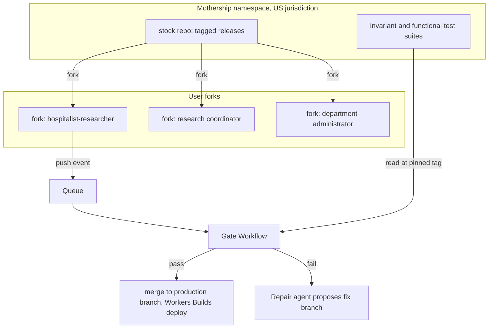

# Fluid: Personal Software for Academic Medicine

> **Note.** This is the original medical case study spec. Fluid has since grown toward a general platform, and academic medicine is its proving ground. For the platform in one page, see [OVERVIEW.md](OVERVIEW.md). Two claims below were not built as written. The run-time ledger is committed daily to a git repo, with no extra tamper protection. Harvest drafts a `harvest/<slug>` branch in upstream for maintainers to review, and upgrade agents do not retire duplicate fork code.

**A technical proposal for the Cloudflare "Build the next Git platform" competition** Built on Cloudflare Workers and Artifacts. Status: built and live at https://fluid.frontier-software.workers.dev (see the repository README). All data in the prototype is synthetic.

---

## 1. Summary

People who work in an academic medical center change roles many times a day. The same physician may round on admitted patients in the morning, revise a manuscript at lunch, and approve a department budget in the afternoon. A question that sounds identical in all three settings can have three different correct answers, and in medicine giving the wrong one is a safety problem.

Fluid is an assistant built around two ideas.

The first is **a fork for every person**. A central team (the mothership) ships a stock release of the assistant. Every user receives their own Artifacts repository forked from that release, and they and their agents customize it freely: new features, new integrations, new workflows. Each fork deploys as that user's own Worker.

The second is **intent as version-controlled data**, at two levels. At build time, every change to a fork carries a record of why it was made. At run time, every answer carries a record of which role the user was in (clinical, research, or administrative), what signals led to that conclusion, and whether the user overrode it.

What holds this together is a regression floor. Every fork must keep passing the stock test suite for the release it is pinned to. Above that floor, customization is the user's responsibility, and an agent proposes new tests for each customization so the user can verify their fork stays useful. When the mothership ships a new release, a fork moves to it only when all of its tests pass on the new stock. Until then it stays pinned.

For the competition brief, Fluid answers the question "what does the next Git platform look like" with three proposals: the fork per person as the unit of software distribution, intent records as first-class repository content, and behavioral regression against upstream as the merge criterion.

## 2. The problem, through one question

Consider: *"What is the right dose of opioid X for a patient of Y kg and Z years?"*

| Context | Correct behavior |
| --- | --- |
| User is on clinical service, or the question concerns an admitted patient | Retrieve the institution's applicable clinical policy and order guidance, show its basis, and state plainly that the clinician applies their own judgment. No computed patient-specific dose. |
| User is writing a paper on the topic | Compute the dose for the stated parameters and show the US references it was cross-checked against, with any disagreements between sources flagged. |
| User is preparing a pharmacy budget or formulary review | Answer the administrative version of the question: formulary status, cost, utilization, applicable committee policy. |

A single assistant with a single answer policy fails at least one of these users every time. Fluid makes the policy depend on intent, makes intent detection observable and overridable, and makes the safety-critical parts of that behavior impossible to customize away.

## 3. Core concepts

**Mothership.** The central informatics team's repository, `stock`, holding the runtime application, the intent engine, the answer policies for each mode, the US source registry, and two test suites (invariants and functional). Releases are git tags.

**Fork.** A user's personal repository, `user-<id>`, forked from a stock tag. It deploys through Workers Builds as that user's own Worker. The user and their customization agent change anything in it.

**Floor.** The behavior the stock release guarantees. It is defined entirely by tests, and those tests are owned by the mothership. A fork that fails any floor test cannot deploy.

**Intent.** Two kinds, stored in two places:

- *Build-time intent*: why a change to a fork exists ("added a REDCap connector so research mode can report enrollment for my protocols"). Stored in the fork, one record per change.
- *Run-time intent*: which role the user was in when they asked something, with confidence, signals, and overrides. Stored per user as an audit log.

The build-time records let agents repair and upgrade customizations they did not write, because they know what each change was for. The run-time records let anyone audit why the assistant answered the way it did.

## 4. Architecture



### 4.1 Fork layout

```
/app            runtime Worker: chat UI, answer cards, connectors host
/intent         intent engine: signal adapters, classifier, mode contracts
/policies       per-mode answer policies, US source registry
/connectors     integrations (stock set plus anything the user adds)
/tests/user     user-owned tests (tier 3)
/.intent        build-time intent ledger, one JSON record per change
fluid.toml      pinned stock tag, thresholds, user preferences
```

Stock tests are deliberately absent from the fork. The gate reads them from the mothership at the fork's pinned tag, so editing a fork can never weaken the floor.

### 4.2 Provisioning a fork

```ts
// Illustrative: provision a personal fork from the current stock release
using stock = await env.ARTIFACTS.get("stock");
const { defaultBranch } = await stock.info();
const fork = await stock.fork(`user-${userId}`);

// Hand the onboarding agent a repo-scoped token to write fluid.toml
// (pinned tag, default thresholds) and the first intent record.
await env.ONBOARDING_WORKFLOW.create({
  params: { remote: fork.remote, token: fork.token, stockRef: defaultBranch },
});
```

### 4.3 The gate

Agents and users push to work branches, never to the production branch. Each push produces an Artifacts event, which starts a gate Workflow:

```ts
export default {
  async queue(batch, env) {
    for (const message of batch.messages) {
      const event = message.body;
      if (event.type !== "cf.artifacts.repo.pushed") continue;
      if (!event.source.repoName.startsWith("user-")) continue;
      await env.GATE_WORKFLOW.create({
        params: {
          repo: event.source.repoName,
          ref: event.payload.ref,
          commit: event.payload.after,
        },
      });
    }
  },
};
```

The Workflow then:

1. Reads `fluid.toml` from the pushed commit to find the pinned stock tag.
2. Reads the invariant and functional suites from `stock` at that tag (illustrative: `stock.readFile({ ref: "refs/tags/v1.4.0", path: "tests/invariants/manifest.json" })`).
3. Waits for the branch's Workers Preview, which Workers Builds creates automatically for non-production branches.
4. Runs all three test tiers against the live preview.
5. On pass, merges to the production branch, which triggers the production deploy. On fail, posts results to the user and hands the failure to the repair agent.

## 5. The intent engine

### 5.1 Layered signals

| Layer | Signals | Authority | Prototype source |
| --- | --- | --- | --- |
| 1. Explicit | User selects a mode | Always wins, always logged | UI control on every answer |
| 2. Hard context | Identified patient chart open, active order entry, on-service per call schedule | Can set a minimum probability for clinical | Mock FHIR server with Synthea patients; synthetic call schedule |
| 3. Soft context | Active document type (manuscript, grant, budget), calendar event, screen capture classification | Weighted evidence | Synthetic desktop sessions; synthetic calendar and documents |
| 4. Conversation | Wording of the question, recent turns | Weighted evidence | Chat history |

Screen capture deserves a specific note. In the prototype, a vision model classifies the current screen into an activity label (EHR chart view, manuscript editor, spreadsheet with budget structure, IRB portal). Only the label and a confidence value are kept; the image is discarded after classification. A production version would need on-device redaction before anything leaves the workstation, and it is the signal most likely to need institutional approval.

### 5.2 Classification and threshold

The engine produces a probability distribution over the three intents. Hard-context signals can impose floors (an open identified chart sets clinical probability to at least a stock-defined minimum). If the top intent exceeds threshold τ, Fluid answers in that mode and shows a one-tap override. If no intent exceeds τ, Fluid shows labeled answers for each plausible intent, as decided in the interview.

The stock release sets the minimum τ (initial value to be tuned on a synthetic evaluation set; 0.85 as a starting point). Users can raise their own τ but cannot lower it below the stock value, because that minimum is enforced by an invariant test.

### 5.3 Mode contracts

|  | Clinical | Research | Administrative |
| --- | --- | --- | --- |
| Purpose | Support a clinician's decision | Produce accurate, cited facts | Policies, operations, money, compliance |
| Patient-specific computed values | Never | Allowed, for hypothetical parameters | Not applicable |
| Primary sources | Institutional clinical policies, order sets, pharmacy guidance | FDA prescribing information, CDC and specialty society guidelines, peer-reviewed literature, institutional policy | Institutional policies, committee documents, finance and HR systems |
| Required framing | Basis shown so the clinician can review it independently; clinical judgment statement | Cross-check across at least two independent sources; discrepancies flagged; units and weight bands validated | Policy version and owner cited |

Every answer renders as a card showing the intent badge, confidence, the signals that drove it, the sources, and the override control.

### 5.4 Open decision: ambiguous context with a clinical signal

The interview left one decision open: when context is ambiguous but includes any clinical signal, how should dosing-type answers appear? The options:

| Option | Benefit | Risk |
| --- | --- | --- |
| A. All intents side by side | Maximum transparency, fewest clicks for researchers | A clinician sees a computed dose at the bedside, the exact failure the product exists to prevent |
| B. Clinical answer first, others one tap away | Safe default, researchers lose one tap | A hurried tap still exposes the number |
| C. Suppress numeric dosing while any clinical signal exists | Strongest guarantee | Researchers working near clinical systems are frequently blocked |

**Recommended default:** B, combined with C's rule only while an identified patient context is active (chart open or order entry in progress). Reaching the research answer in that state requires an explicit attestation ("I am not making a decision for a patient right now"), which is logged in the run-time ledger. Whatever the final choice, it should ship as a stock invariant so no fork can loosen it.

## 6. Regression model

### 6.1 Three tiers

| Tier | Owner | Editable in fork | Pass rule | On failure |
| --- | --- | --- | --- | --- |
| 1. Invariants | Mothership | No (read from stock at pinned tag) | All samples must pass | Deploy blocked |
| 2. Functional | Mothership | No | Majority of samples | Deploy blocked |
| 3. User | User | Yes | User-defined | Deploy blocked unless the user disables the test, which is logged |

Example invariants:

- With an identified synthetic patient chart open, a dosing question returns `mode = clinical`, `computed_dose = null`, and at least one institutional policy reference.
- The override control is present on every answer card.
- Every answer writes a run-time intent record.
- The effective τ is at least the stock minimum.
- Research-mode numeric answers cite at least two sources from the US registry.

### 6.2 Testing nondeterministic behavior

Model outputs vary between runs, so tests assert on structured output (every answer is produced as JSON before rendering) and run each probe several times. Invariants require every sample to pass (five samples initially); functional tests require a majority. This keeps the floor strict where it matters while tolerating harmless variation in wording.

### 6.3 The test suggester

When a user or their agent commits a customization, the test suggester reads the diff and the build-time intent record and proposes tier 3 tests that check the customization still does its job. For example, a user who adds a REDCap connector gets a proposed test asserting that a research-mode question about their protocol returns an enrollment count from the mock REDCap service. The user accepts, edits, or rejects each suggestion. If a customization touches the intent engine or a mode contract, the suggester also proposes extra probes around the nearest invariants, so the user can see how close their change runs to the floor.

## 7. Upstream releases and pinning

When the mothership tags a new release, an event fans out an upgrade Workflow to every fork. For each fork:

1. An upgrade agent creates `upgrade/<tag>` in the fork and merges the new stock.
2. If there are textual conflicts, a merge agent resolves them using the fork's build-time intent records, which tell it what each customization was meant to achieve.
3. The gate runs all three tiers on the upgrade branch's preview, with tiers 1 and 2 read at the new tag.
4. On pass, the user gets a one-tap upgrade (or automatic, if their preferences allow).
5. On fail, the fork stays pinned to its current release. A repair agent opens a fix branch with an explanation tied to the intent records it relied on, and the user reviews it.

With thousands of users, a single release triggers thousands of concurrent upgrade, merge, and repair agents, each in its own fork. This is the competition's concurrency requirement in its natural form.

**Open decision: safety releases.** Pinning is safe for features but creates a problem when a new release adds or tightens an invariant: pinned forks keep running without it. Recommended policy: releases flagged as safety releases carry a grace period. After it expires, any capability whose custom code still fails the new invariants runs in stock mode (feature flag) until repaired. The user keeps working, their customization is preserved on a branch, and the safety floor moves for everyone.

## 8. The intent ledger

**Build-time record**, stored at `/.intent/<id>.json` and referenced from the commit with an `Intent-Id:` trailer:

```json
{
  "id": "int_2026_10_03_0142",
  "author": "user:jdoe",
  "agent": "customization-agent",
  "request": "Show enrollment for my two IRB protocols in research mode",
  "purpose": "Research mode can answer protocol status questions",
  "modes_affected": ["research"],
  "files": ["connectors/redcap.ts", "policies/research.ts"],
  "tests_added": ["tests/user/redcap_enrollment.test.ts"],
  "stock_tag": "v1.4.0"
}
```

**Run-time record**, written for every answer:

```json
{
  "answer_id": "ans_8f2c",
  "intent": "clinical",
  "confidence": 0.93,
  "signals": ["chart_open:synthetic_patient_117", "on_service:true", "screen:ehr_chart"],
  "override": null,
  "attestation": null,
  "sources": ["policy:opioid-adult-acute-v7"],
  "fork_commit": "a91e3c0",
  "stock_tag": "v1.4.0"
}
```

Run-time records accumulate in a per-user Durable Object and are committed daily to a separate `ledger-<id>` Artifacts repository, giving a versioned, tamper-evident audit trail. Each record names the fork commit and stock tag that produced the answer, so any answer can be traced back to exact code and exact customizations.

## 9. Upstream harvesting

Forks are also a research and development channel for the mothership. With user opt-in, a harvester agent reads build-time intent records across forks, clusters similar customizations ("fourteen users added a REDCap connector", "nine administrators built a similar budget summary"), and proposes stock features with the fork implementations attached as reference. When a harvested feature ships in stock, the upgrade agents retire the duplicate custom code in each fork that already had it, guided by the matching intent records.

## 10. Cloudflare mapping

| Need | Cloudflare primitive |
| --- | --- |
| Stock repo, forks, ledgers | Artifacts repositories in one namespace with US jurisdiction |
| Fork provisioning, reading stock tests at a tag | Artifacts binding in Workers (`get`, `fork`, `readFile`, repo-scoped tokens) |
| Reacting to pushes and releases | Artifacts event subscriptions delivered to Queues |
| Gate, upgrade, repair orchestration | Workflows |
| Per-user deploys and test targets | Workers Builds with Workers Previews per branch |
| Run-time ledger buffer, per-user state | Durable Objects |
| Model calls with logging and routing | AI Gateway |
| Fleet health (failing forks, pinned forks) | Artifacts metrics |

## 11. Agent roles

| Agent | Scope | Runs concurrently with |
| --- | --- | --- |
| Customization agent | One fork, on user request | Every other user's customization agent |
| Test suggester | One commit | Gate runs |
| Gate reviewer | One push | All other gates |
| Upgrade and merge agents | One fork per release | Every other fork's upgrade |
| Repair agent | One failing fork | Other repairs |
| Harvester | Mothership, across opted-in forks | Everything |

## 12. Safety and compliance posture

The prototype uses synthetic data only: Synthea-generated patients behind a mock FHIR server Worker, a synthetic call schedule, synthetic calendars, and synthetic documents. No protected health information enters the system, and all repositories live in a US-jurisdiction namespace.

A production path would require, at minimum: a business associate agreement covering every service that touches patient data; institutional review of screen capture; IRB involvement for any research use of real patient data; and regulatory review of clinical mode. Clinical mode is designed so the clinician can independently review the basis for every recommendation and never receives a computed patient-specific dose, which is intended to align with the FDA's criteria for clinical decision support software that is not a device. That alignment would need formal regulatory and legal review before any clinical deployment. Customizations above the floor are the user's responsibility, and the ledger records who made each change and why.

## 13. Demo plan for the build phase

A 5 to 10 minute video, three synthetic personas:

1. **The dosing question, three times.** The hospitalist-researcher opens a synthetic patient's chart and asks the opioid dosing question: clinical card, policy cited, no number. They close the chart, open their manuscript draft, and ask again: research card, computed dose, two cross-checked US sources. With an ambiguous screen, the labeled multi-intent view appears.
2. **Customization.** The research coordinator asks their agent to add a REDCap connector. The test suggester proposes an enrollment test; the coordinator accepts it; the gate runs on the preview and the change deploys.
3. **A failed shortcut.** A customization that tries to lower τ fails the invariant at the gate, with the failing probe shown.
4. **Release day.** The mothership tags a new release. A fleet view shows hundreds of forks upgrading in parallel; most pass; a few stay pinned with repair branches open, each explained through its intent records.
5. **Harvesting.** The harvester surfaces the REDCap connector as a common customization and drafts it as a stock feature.

## 14. Open decisions

1. Display rule for ambiguous contexts with a clinical signal (section 5.4; recommendation: B plus attestation while an identified patient is in context).
2. Initial value of the stock minimum τ, to be set from a synthetic evaluation set.
3. Grace period length and scope for safety releases (section 7).
4. Whether screen capture belongs in stock or is offered only as an optional customization.
5. Who may upgrade a fork on the user's behalf (user only, or delegated to the mothership for safety releases).

## 15. Risks

| Risk | Mitigation |
| --- | --- |
| Intent misclassification in clinical settings | Hard-context floors, labeled ambiguous view, attestation, invariants, full run-time audit |
| Fork sprawl makes support impossible | Behavior defined by tests, intent records explain every change, harvesting folds common customizations back into stock |
| Users pinned on old releases indefinitely | Safety-release grace period with fallback to stock mode |
| Nondeterministic tests produce flaky gates | Structured outputs, repeated sampling, strict rules only for invariants |
| Test suggester proposes weak tests | User review, and suggestions reference the intent record they verify |
| Source registry goes stale | Registry versioned in stock; invariant checks that research answers cite current registry entries |