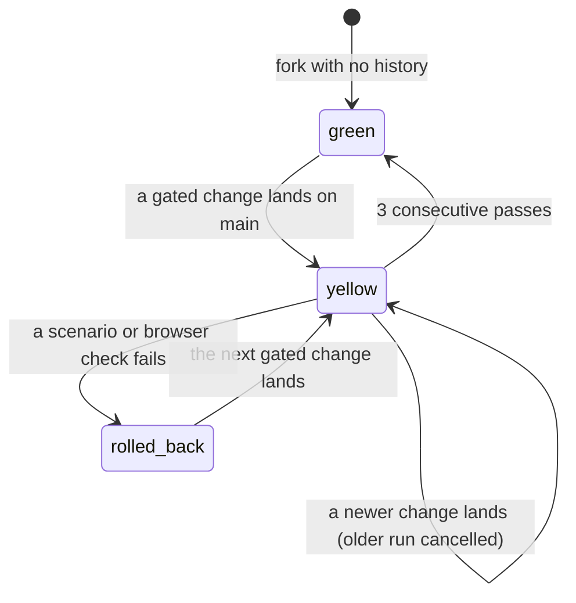

# Gate and agents

How Fluid's control plane (`platform/`) gates fork changes and runs its agents. Spec sections 4.3, 6, 7, 8, 9, and 11. For the platform in one page, see [OVERVIEW.md](OVERVIEW.md).

## Workflows

All agent work runs in Workflows, declared in `platform/cloudflare.config.ts` and called through `ctx.exports`. Every run writes its timeline to a `Runs` Durable Object (`GET /api/runs/:runId`), and fork status changes go to the `Fleet` Durable Object, which streams them over `GET /api/fleet/stream`.

| Workflow | Name | One instance per | What it does |
| :-- | :-- | :-- | :-- |
| `GateWorkflow` | `fluid-gate` | push (repo, branch, commit) | Checks that intent records are only added, and drafts one for an outside change that has none (see "Outside pushes"). Runs tiers 1 to 3 against the pushed commit. On a pass `main` fast-forwards to that commit (see "Main only fast-forwards"); on a fail `main` is untouched and a repair starts. `repair/*` branches are only checked, unless the user applies one. |
| `CustomizeWorkflow` | `fluid-customize` | user request | Plans the change (a recipe or the agent model), checks its imports and loads it in an isolate (a model-written change gets up to 2 repairs, see "Customization checks and repairs"), writes `.intent/<id>.json`, has the suggester propose tier 3 tests, waits for the user's decisions, commits on `work/<slug>` with an `Intent-Id:` trailer, records the gate link, pushes, starts the gate, and waits for the gate's (and any repair's) event. |
| `ContestWorkflow` | `fluid-contest` | contest | Runs 2 or 3 contestants for one wish at the same time, each on `work/contest-<id>-<label>`, gates each in check mode while keeping the fork's answer to every probe, diffs the answers against main, picks a winner by a fixed rule, waits for the owner's pick, and gates only the pick in merge mode (see "Contest"). |
| `RepairWorkflow` | `fluid-repair` | failed gate or yellow rollback | Opens `repair/<short-sha>` with `.repair/<short-sha>.md`, a repair intent record (`relies_on` lists the records it used), and a fix when a rule applies (restore tau, revert a customization that broke the clinical or research floor). A yellow repair works differently (see "Yellow to green"). It checks the fix in check mode and never merges it; the user applies it. |
| `ReleaseWorkflow` | `fluid-release` | release | Starts one upgrade per fork that still needs the tag, in batches of 20 with a 1 second pause between batches. |
| `UpgradeWorkflow` | `fluid-upgrade` | (tag, fork) | First tries intent replay: when every wish can be run again, builds `replay/<tag>` from stock at the tag plus the fork's wishes and gates it (see "Intent replay"). Otherwise, or if that gate fails, creates `upgrade/<tag>`, merges the stock tag (the merge agent resolves conflicts), and runs the gate at the new tag. It then fast-forwards `main` if `auto_upgrade` is set, or records a pending upgrade for one-tap approval. On a fail the fork stays pinned and a repair opens. |
| `SeedFleetWorkflow` and `SeedForkWorkflow` | `fluid-seed-fleet`, `fluid-seed-fork` | seed batch, seeded fork | Builds the synthetic demo fleet (see "Demo fleet"). |
| `YellowWorkflow` | `fluid-yellow` | change landed on main (repo, commit) | Runs the end-to-end tiers against the live fork 3 times with a 10 second pause, plus the browser checks once. All passes turn the fork green; a failure the fork caused, or a soak that cannot finish, rolls `main` back to the last green commit and opens a repair (see "Yellow to green"). |
| `ImportWorkflow` | `fluid-import` | push of a `work/*` branch to an inbox | Takes the import quotas, fetches that branch head, refuses it over a cap or with an unsafe path, pushes it to `work/inbox/<name>` in the fork, and starts its gate (see "Outside pushes"). |
| `InboxCleanupWorkflow` | `fluid-inbox-cleanup` | outside token | Deletes the inbox 15 minutes after its token expires, unless a newer token replaced it. |
| `HarvestWorkflow` | `fluid-harvest` | harvest run | Reads intent records from forks that opted in, clusters them, labels the clusters with the model, and drafts the eligible ones as `harvest/<slug>` branches in `stock`. Each run replaces earlier drafts. |

If a step fails after all its retries, the run is marked `failed` with the error and the instance ends as errored. A run is never left showing `running`.

## Gate integrity

- **Floor source.** Tiers 1 and 2 always come from `stock` at the tag pinned in the fork's `fluid.toml` at the pushed commit. Copies of `tests/` inside a fork are never loaded.
- **Published pins only.** `stock_tag` must be a `vMAJOR.MINOR.PATCH` tag that exists in `stock` and is a recorded release (in the fleet's stock tags or with `releases/<tag>.json`). It is resolved only as a tag (`ls-refs refs/tags/`, peeled), never as a branch or SHA. Anything else fails tier 1 as `stock-tag-published`.
- **Pin monotonicity.** In merge mode (anything that can reach `main`: work branches, upgrades, applied repairs) the pin must be at least `main`'s pinned tag and at least the latest safety release. Otherwise tier 1 fails with probe `pin-monotonic` (`stock_tag gte <floor>`), next to whatever the suites found. Check mode (repair checks, the admin suite) only reports.
- **Runner isolation.** Stock's `tests/runner.ts` runs in its own Worker Loader isolate (`stock-runner:<stock sha>`). That isolate is built only from stock's runner, `app/toml.ts`, and `app/types.ts` at the pinned tag. It has no env and no network. It reaches the fork only through an `ask` callback passed over RPC. The fork runs in a separate isolate with a fresh variant per gate run (`<repo>:<sha>:gate-<nonce>`), never the production isolate, so no module state carries over between production and gates. The fork serializes its card to a JSON string itself and the platform parses it (at most 256 KB), so the gate and production only see plain data.
- **Fork errors and infrastructure errors.** Only problems the fork caused fail a tier: a missing ref, an unusable pin, code that does not build (`ForkCodeError`: transform errors, invalid JSON, no `app/index.ts`), and an invalid tier 3 manifest. Any other error (Artifacts or the loader unavailable, the stock suite failing to run) is thrown, so the workflow step retries it and no repair opens for an infrastructure problem.
- **Time limits.** Each fork call from the platform is limited to 10 seconds, and each sample in the runner to 5 seconds.
- **Tier 3.** Tier 3 is the fork's `tests/user/manifest.json`, always run as tier `user`. It is validated before it runs (the runner's rules, unique ids, positive integer samples, and the regex limits: a `notMatches` pattern of at most 200 characters with no group that repeats an unbounded quantifier without bound, such as `(a+)+`). The platform checks the regex limits itself too, because a fork may pin a stock tag whose runner predates them (`platform/src/gate/regex.ts`). Sample counts are capped at 10 (manifest and per probe) and the list at 20 probes; the tier notes any probes left out. A probe with `"disabled": true` is skipped, and the gate logs it with its `disabledReason` in the run steps and the tier summary.
- **Test ids.** Suggested tests are named `t-<intentId>-<name>` (near-invariant copies `near-<intentId>-<probe>`). Adding accepted tests never replaces a probe that belongs to another intent or that the user wrote; a retried commit may replace its own intent's probes.
- **Model access.** Fork isolates have no model access by default. Only the `:llm` variant, which `POST /api/ask` uses when `useModel` is set, gets the `LLM` capability. `LlmHost` limits model calls to 20 per minute per repo and 200 per minute across the platform.
- **Gateway backstop.** The `fluid` AI Gateway itself allows at most 300 requests per minute (fixed window), set with `cf ai-gateway gateways update fluid --rate-limiting-limit 300 --rate-limiting-interval 60 --rate-limiting-technique fixed`. The update is a full PUT, so it repeats every current setting unchanged (`workers_ai_billing_mode` stays `postpaid`, `byok_only` stays false, no spend limits); rate limiting is not billed. It caps every model caller together, including the platform's own agents, if a code path ever skips the per-repo and global budgets.
- **Repairs.** Repair branches are never merged automatically. Applying one (`POST /api/forks/:repo/repairs/:sha/apply`, or the Apply button) gates it in merge mode, and `main` fast-forwards to it only if every tier passes.

## Customization checks and repairs

Nothing is committed until the planned change passes these checks, so a failed customization never leaves a branch behind (`platform/src/agents/attempts.ts`, `platform/src/agents/imports.ts`, `validateCandidate` in `platform/src/workflows/customize.ts`):

1. **File rules.** At most 3 files, only under `app/`, `intent/`, `policies/`, `connectors/`, or exactly `ui/preferences.json`; each file parses, and `ui/preferences.json` matches its schema.
2. **Static imports.** Every import in a changed runtime file must resolve to a file in the fork's tree or in the change, under the name the module map uses (`foo.ts` is loaded as `foo.js`, JSON keeps its name). Bare package specifiers are rejected. This catches a plan such as a wrapper of `app/cards.ts` that imports a `./cards.base.js` it never wrote, before any isolate loads.
3. **Load and smoke test.** The fork is loaded with the change overlaid in a throwaway isolate variant and must answer one question with the card contract.

For a model-written change, any failure in these steps (or a plan that is not valid JSON) goes back to the model with the exact error, at most 2 times. A recipe runs once. If the change still fails, the run ends as `failed` with a plain explanation in `error` and a "Nothing committed" step: what was attempted, why it could not be loaded (first line of the error, no stack, tokens redacted), and what to try. A recipe that cannot apply (the REDCap connector already exists, a fifth tab) ends the same way.

The planner prompt states that look and layout (fonts, density, colors, tabs, charts, dashboards) never go into answer card code, that card JSON stays the stock contract, and that such requests write only `ui/preferences.json`.

## Contest

A contest lets several agents compete to grant one wish. A behavior diff replaces the pull request, and a fixed rule picks the winner (`platform/src/workflows/contest.ts`, `platform/src/contest/`).

- **Start.** `POST /api/contests` with the request, `size` (2 or 3, default 3), and `includeAgent`. The lineup (`lineup` in `contest/plan.ts`): the fixed recipe first when one matches the request, then model plans that fill the other seats, each with its own instruction and temperature (A: smallest change, 0.2; B: direct and careful, 0.6; C: edit in place, 0.9), through the same planner, checks, and repair loop as a customization. With `includeAgent`, the owner's own agent takes the last seat. N counts every seat.
- **Cost and limits.** A contest of N takes N customizations from the owner's hourly quota (10) and one of 30 contests an hour across the platform. When a later unit or the platform cap refuses, the units already taken are given back (`Quota.give`). One contest per fork at a time: a Fleet lease owned by the contest's run id, renewed for 2 hours at each phase (contestants ready, waiting for the pick, shipping), and released only by that run when the contest ends or errors. If the run record, the open contest, or the workflow cannot be created after the lease and quota were taken, the route closes the contest (so no inbox push can join it), releases the lease, marks the run failed, and gives the quota back. Admin test recipes cannot run as a contest.
- **Contestants.** All platform contestants plan, check, and commit at the same time (parallel workflow steps). Each commits on `work/contest-<id>-<label>`: the change and its intent record in the first commit (the record carries `contest: {id, label, runId}`), then its suggested tests in `tests/user/manifest.json`. In a contest every suggested behavior test is accepted, with no review step. A contestant whose plan does not pass the checks has no change and no branch; the others go on.
- **Your own agent.** It joins by pushing `work/contest-<id>/<name>` to the inbox while the join window is open (5 minutes from the start). The push is imported like any other inbox branch (quotas, caps, unsafe paths) as `work/inbox/contest-<id>/<name>`, but it is not gated on its own: the import takes the contest's agent seat (once, atomically in the Fleet object) and wakes the contest. A push to a contest that is unknown, closed, without an agent seat, or already joined is refused in the quota step, before any quota is taken or anything is imported, like any other refused import (no run record, only a log line). Its records must still only be added and may not claim a platform agent's name; tier 1 fails otherwise. If it has no record, the merge gate drafts one if it is shipped.
- **Never past the gate.** Push events and `POST /api/gates/:repo` ignore contest branches, and only the shapes a contest makes: `work/contest-<12 hex>-<label>` and `work/inbox/contest-<12 hex>/<name>` (`isContestBranch` in `events/filter.ts`). A branch such as `work/contest-notes` is gated like any other. The merge gate gets the exact commit the contest checked, not whatever the branch points at by then. The contest gates each contestant and main in check mode; only the contestant the owner ships is gated in merge mode, through the normal Gate workflow (source `contest`, or `import` for the owner's agent), so it lands only by fast-forward and then soaks in yellow with rollback, like any change. No repair agent starts for a contest pick.
- **Wish tests.** The suggested tests of all platform contestants, with copies of one test (same request and assertions) merged, at most 12 (`wishTestSet` in `contest/observe.ts`). Every candidate and main run all of them: a candidate's own copies are in its tier 3, the rest run on the side and never change its verdict. The owner agent's own new tests run in its tier 3 but are not wish tests, so an outside test cannot disqualify the others.
- **Behavior capture.** For each probe the gate runs (stock invariants and functional at the pinned tag, the fork's own tests, and the wish tests), the platform keeps the card the fork answered, in the host ask callback, keyed by the request (`runGateObserved` in `gate/run.ts`). Stock's runner and its isolate are unchanged. Cards are compacted: answer ids and the fork commit are dropped, strings are cut at 300 characters, lists at 8 items, objects at 40 keys, nesting at 6 levels. The requests recorded are chosen before the run, in manifest order (invariant, functional, your tests, wish tests), at most 200 distinct ones, so main and every candidate record the same set even though the runner sends requests in no fixed order. An evaluate step's output stays under 700 KB: past that, cards are dropped (probes outside the wish first, then wish tests), the probe keeps its result and a short hash of the compacted card, and the diff compares that hash with main's card: a mismatch counts as one change (outside the wish unless the probe is a wish test). A probe with no hash (an older record) compares by result only.
- **Behavior diff.** One row per probe, one cell per candidate (`behaviorTable` in `contest/behavior.ts`): the probe's result and the fields added, removed, or changed against main's card (12 listed per cell, all counted). A change is inside the wish when the row is a wish test, or when only the wording (body, framing, sources) changed in an answer whose mode the wish tests ask about and the result stayed the same. A test main never ran (one the owner's agent added, or a platform contestant's suggested test left out by the 12-test wish cap) has the scope "own": it is shown as a new test and never counts against anyone; another contestant simply did not run it. Everything else counts as outside: another mode, any change to mode, confidence, dose, attestation, override, or ledger fields, a changed result, or a probe the candidate no longer runs. At most 60 rows are kept (rows with changes first) and the stored diff is trimmed to 400 KB.
- **Winner rule** (`contest/winner.ts`, plain code): (a) every tier passed and every wish test passed; (b) fewest behavior changes outside the wish; (c) fewest files changed, not counting intent records and `tests/user/`; (d) finished first, then lineup order. The reason is written in plain words ("model-a wins: like model-b, it passed every tier and every wish test, and it changed behavior on 0 probes outside the wish (model-b: 2)."), and every other contestant gets a note "lost to X because Y". No eligible contestant means no winner: nothing ships and every branch stays.
- **The pick.** The contest waits up to an hour. `POST /api/contests/:runId/pick` ships the winner or overrides it with another contestant that passed rule (a); a contestant that did not pass is refused. The run object sets the pick once, so of two picks at the same moment only the first is sent and shown. If sending the pick to the contest fails, the route clears the pick again, so the owner can pick again instead of being told a contestant was already picked. With no pick in an hour, nothing ships. Loser branches stay. Their notes go into the contest run record (`notes`) and the wishes in flight, never into an existing `.intent/` file, because records are append-only.
- **Live timeline.** The contest run (`run_contest_<id>`) has the overall steps and a `contestants` list that each contestant updates in place (`Runs.updateEntry`, one call at a time, so parallel writers never overwrite each other). Each contestant also has its own child run (`run_contest_<id>_<label>`) with its plan, commit, and tier steps.

Limits: model plans for a recipe request may not apply (a model plan may not edit `fluid.toml`), and then that contestant has no change. The rule compares answers, so a change with no effect on any probe's answer (for example, a new connector no probe asks about) ties on behavior and is decided by files and time. Check gates run each candidate once with the manifests' sample counts; the merge gate runs again on the pick. If the import of the owner's agent claims the seat while the window closes, the contest waits up to 10 seconds for its entry. A retried join step of the import that already took the seat (same branch and commit) succeeds again. Losing contest branches are not deleted (no route deletes fork branches today); the wishes list shows the newest 20 branches, so old losers drop out of it as new work arrives.

## Wishes in flight

Any agent or the UI can see what else is being worked on in a fork before it starts: `GET /api/forks/:repo/wishes` (`contest/read-wishes.ts`).

- **Who sees what.** Branches and the intent records they add are public, like `GET /api/intents/:repo`. The notes, which carry the request text of runs that have not pushed anything yet, go only to the fork's owner and the admin (`notesIncluded` in the response). The branch part is cached per fork for 10 seconds, and the route has a platform-wide quota of 300 reads a minute next to the per-client read quota. The Artifacts binding cannot list refs, so each uncached read mints one short read token to list them over git.
- **Branches.** The newest 20 `work/*` branches by head commit time (of the first 60 by name) with the intent records each adds since main (at most 3 read per branch), its head, and its status: the note of the run that follows it, or else the gate of its current head ("gate passed", "gate failed"), or else "open". Outside imports appear with their drafted or pushed record.
- **Notes.** Customize and contest runs leave a note in the Fleet object (`Fleet.noteWish`, at most 30 per fork, dropped after 48 hours): a customization when it records its intent ("planned; waiting for your test decisions"), when its gate starts, and when it ends; each contestant when its branch is ready, after the decision ("winner; waiting for your pick", "lost to X because Y"), and when the contest ends. A run whose branch is not pushed yet is listed with the branch it will use and no head.

## UI preferences

`ui/preferences.json` is a declarative, fork-owned file that changes how the control plane looks for the fork's owner (schema in `platform/src/ui/preferences.ts`, described in `docs/UI.md`). It is never runtime code: the loader ignores it and no fork code runs in the browser.

- **Recipe.** Requests about a look, fonts, density, accent colors, or a tab, page, or dashboard with charts match the `ui` recipe (`platform/src/agents/ui-recipe.ts`), checked after the REDCap and tau recipes. It maps the request onto the closest allowlisted values, merges them into the current file (a tab with the same title is replaced; a fifth tab is refused), and records each mapping in the run, the diff note, and the intent record's `mapped` field. For example, "Always use palatino lino type kind of fonts and add a tab with charts" maps "palatino lino type kind of fonts" to the `palatino` stack and "a tab with charts" to a tab titled "Charts" with the default set of all 6 widgets. Named widgets ("override rate and confidence") narrow the set, and "called X" names the tab. "add a page of charts" becomes the same "Charts" tab, and the note says the page became a tab. A brand or an era maps to a look: one institution's name, "crimson", or "red and white" (or "white and red") followed by look, look and feel, or theme, as in "a red and white children's hospital look", to `crimson` (colors only, no logos or names; red and white with no look word stays an accent color); "Windows XP", "XP", "2001", "Luna", "Y2K", "retro", or "early 2000s" to `luna-xp`; and "default look", "standard theme", "original style", or "reset the look" to `standard`. These words are common in other requests ("the 2001 guideline", "that hospital's protocols", "the XP score"), so a look matches only when the clause that names it also talks about the look (look, look and feel, feel, theme, style, skin, UI, design, appearance, colors, palette, branding, or brand colors) and does not talk about answer content (answers, cards, citations, protocols, patients, guidelines, scores, doses, enrollment, connectors, or the ledger). Other clauses may: "make it look like Windows XP and add a tab with charts of answers by intent" maps both the look and the tab, while "add the 2001 cutoff to the formulary lookup and change the colors" maps no look. "Answers" followed by view, page, tab, screen, or panel is a part of the UI, not answer content. "Windows XP" needs no look word, unless its clause is about answer content. "Style guide" is never a look. The same look words and "branding" or "brand colors" count as color words, so "make the look red" sets the `rose` accent. A chart tab is not created when the request adds something to answers or cards ("a section on dosing trends to research answers").
- **Mixed requests.** When a request maps to UI preferences but another clause maps to no preference and changes answer content ("cite the 2001 guideline in clinical answers and use the default style", "make the answer text larger and use Palatino"), the ui recipe does not match and the model gets the whole request, so the code part is not dropped. A clause that maps a preference stays UI even when it names answers, cards, or citations ("Use Georgia for the answer cards", "Make the links in answers blue"). Clauses about a chart tab, and words that only name its charts ("a tab with charts, citations and answers"), are UI too.
- **Model plans.** Requests no recipe matches go to the model. Its prompt lists the allowed keys and values and includes the current `ui/preferences.json`, and asks the model to edit that file and keep every key and tab the request does not mention.
- **Intent and tests.** The build-time intent lists `ui/preferences.json` and the record, with no modes affected. The suggester proposes one tier 3 probe of kind `config` with `file: "ui/preferences.json"`, asserting each preference (`look equals crimson`, `font equals palatino`, `tabs some title equals Charts`).
- **Tier 3 on the platform.** Stock's runner reads config probes as TOML only, so stock is unchanged: the gate splits config probes whose `file` is `ui/preferences.json` out of the tier 3 manifest, evaluates them on the platform against the parsed file with the runner's assertion semantics (`platform/src/gate/ui-check.ts`, checked against the runner in `test/ui-gate.test.ts`), and merges the results into the user tier.
- **Tier 1 platform invariant.** When the pushed commit has `ui/preferences.json`, tier 1 gains probe `ui-preferences-valid`. An invalid file (bad JSON, a look or other value off the allowlist, an unknown key, too many tabs or widgets) fails it with `op: "schema"`, the file, and the schema errors, next to whatever the stock suites found.

## Main only fast-forwards

`main` moves only to a commit a gate passed, and only by fast-forward (`git push` without force, so the remote refuses it if `main` moved meanwhile):

- **Work branches.** If `main` moved after the branch was cut, the gate merges `main` into the branch, pushes that merge commit to the branch (never to `main`), and starts a gate for it. That gate runs at the pin the merged `fluid.toml` names and fast-forwards `main` if it passes. A conflict ends the run as failed with the conflicting files; nothing merges.
- **Upgrades.** With `auto_upgrade`, the upgrade fast-forwards `main` to the gated `upgrade/<tag>` or `replay/<tag>` commit (a replay ends in a merge commit whose first parent is `main`, so this is still a fast-forward). If `main` moved, it merges `main` into the branch it gated (`upgrade/<tag>` or `replay/<tag>`) and gates again (at most 2 extra rounds).
- **One-tap approval.** A passed upgrade without `auto_upgrade` is stored as the fork's `pendingUpgrade` (`{tag, commit, runId, branch}`; `branch` is `upgrade/<tag>` or `replay/<tag>`, and older rows without it mean `upgrade/<tag>`), apart from `lastRun`, which later runs overwrite. `POST /api/forks/:repo/upgrade` fetches that branch and fast-forwards `main` to that commit and refuses with 409 when `main` is no longer an ancestor of it.
- **Customizations.** Before committing, the customization checks the planned files against `main`'s current files. A recipe (REDCap, tau) is applied again on the current files; a model plan whose files changed on `main` is refused with "run the request again". A retried commit step reuses a pushed commit whose `Intent-Id` matches instead of committing again.

## Outside pushes

A fork's owner can work with their own agent or editor over plain git. Artifacts tokens are `read` or `write` for one whole repo; they cannot be limited to branches. So the owner never gets a token for the real fork. Nothing outside the platform can write the fork; the platform copies work in.

- **Inbox.** `POST /api/forks/:repo/token` (`platform/src/forks/outside.ts`) deletes the fork's inbox, `inbox-<fork>`, if there is one, forks it again from the fork's `main` (no other branches), and returns a one hour write token scoped to the inbox. So every token starts from the current `main`, and every earlier token and anything pushed with it are gone. Deleting the inbox is expected to end its tokens, but neither the Artifacts docs nor the spike confirmed it, so the mint first revokes the previous token by its id on the old inbox (best effort: a token that is already gone, or an inbox that no longer exists, is logged and the mint goes on). `InboxCleanupWorkflow` (`fluid-inbox-cleanup`) sleeps until the token has expired plus 15 minutes (time for a last import) and then deletes the inbox and the fork's grant, unless a newer token replaced it; it takes the same per-fork lease as minting. The lease lasts 30 seconds; each holder takes it under its own owner id and releases it only while it still holds it, so a mint or cleanup that outlived its lease never releases the lease of the next holder. A mint writes its grant only while it still holds the lease (one `Fleet.setValueIfHeld` call); one that lost it revokes its own token and answers 409, and deletes the fresh inbox only when no request holds the lease and no grant names it, because the inbox name is shared with the request that took over. Deleting a fork (the admin route or the cleanup of seeded forks) also deletes its inbox and grant. The inbox is not a fleet fork: it is not registered in the `Fleet` object, so it does not count toward the 500 fork cap or the per-client fork quota, and it is never seeded, upgraded, harvested, gated, or served by `/api/ask` or `/api/forks/:repo`. Each fork has at most one inbox, and token minting has its own quotas (`docs/API.md`). The fleet value `outside:<fork>` holds the inbox name and the live token's id, never the token.
- **Import.** The queue consumer does no git work for an inbox: for a new head of `refs/heads/work/<name>` (plain name parts, at most 100 characters) it starts one `ImportWorkflow` (`fluid-import`, `platform/src/workflows/import.ts`, instance id from the import run id) and acks. An instance with that id that is running or imported means the push is already handled, so a redelivered event starts nothing. One that ended without importing (refused, skipped, cancelled because the branch moved, errored, or terminated) is passed over, and the consumer starts the next attempt, `-r1`, `-r2`, and so on, at most 20 per commit (`startImportInstance` in `platform/src/forks/inbox.ts`). So pushing the same commit again after a refusal imports it; no new commit is needed. Pushes to the inbox's `main`, tags, `repair/*`, `upgrade/*`, `replay/*`, any other ref, and branch deletions are ignored, and nothing in the fork is ever deleted. The workflow first takes the import quotas: 10 imports per fork per hour (the same as customizations) and 200 per hour across the platform; past either, the import is refused before anything is cloned and before its run record exists, so a flood of pushes past the quota makes no run records. The refusal is in the workflow instance's output (`{status: "refused", reason}`, in the Workflows dashboard for `fluid-import`), in the worker log, and in the fork's import log, not in the fork's runs. It then fetches only that branch by its full ref name, with no tags, and refuses the push, without retrying, when it breaks a cap or a rule: more than 8 MB downloaded (the fetch stops reading past that), more than 5000 tree entries in the fork's or the pushed tree (counted as the walk goes, before the diff is built), an unsafe path (an empty, `.`, `..`, or `.git` part in any case, a backslash, or a control character; isomorphic-git's `UnsafeFilepathError` counts too), more than 50 commits since the fork's `main`, more than 200 changed files, or a file over 1 MB. Otherwise the head is pushed to `work/inbox/<name>` in the fork without force. Customize and seed branches never have a slash after `work/`, so an import can never take or replace one. A `work/inbox/*` branch is replaced (with force) only if an earlier import made it, which a record keyed by the full branch name says; that record is written after the push, and a retry that finds the branch already at the commit writes it then. The import run (`run_import_<sha>_<hash>`, with `-r<n>` for a later attempt) then starts the gate for that commit as its parent, with source `import`. Fetching, inflating, and walking run inside the workflow step, so a hostile push can exhaust only its own import's memory or time, never the shared consumer batch that carries other users' gate triggers.
- **No repair agent.** A failed gate for an imported change (source `import` or `outside-push`) opens no repair: the Repair workflow calls the model, and an outside agent could push as often as its quota allows. The gate says to fix the change in the agent and push again. The repair prompt for other changes lists records written outside the platform under their own heading, quoted, as untrusted data.
- **Drafted intent.** Before the tiers run, a gate for an import (or a push event nobody on the platform made, or the owner's direct trigger) checks that the branch adds a valid `.intent/<id>.json` since it left `main`. If it does not, the gate drafts one (`platform/src/agents/outside-intent.ts`): `author: "outside agent"`, `agent: "outside-agent"`, `source: "outside-push"`, `pushed_by` the owner, the commit subjects as `request`, the files touched as `files` (at most 100, with `files_total`), changed `tests/user/` files as `tests_added`, modes inferred from `policies/` paths, and the short commit ids. It commits the record onto the branch with an `Intent-Id` trailer, pushes without force, and starts the gate for that commit. The first gate run ends there with `draftedIntent` and `regateRunId`; a retried step reuses its own drafted commit. To write your own record, add `.intent/<id>.json` in the push; it must pass the record schema.
- **Records are checked on every gate.** For every gated commit (outside or not), the gate reads the real diff since the branch left `main`. A change that modifies or deletes an existing `.intent/` record fails tier 1 as `intent-records-append-only`. The floor files the diff touches are stored for each record the change adds (fleet value `floor:<fork>:<id>`), and the harvester counts those as well as the files the record lists, so a record cannot hide floor contact. Every reader of intent records checks them against the schema and skips a bad one (`parseIntentRecord`), so one malformed record cannot break harvest or any other reader.
- **Tier 3 and harvest.** Tier 3 runs the fork's `tests/user/manifest.json` at the gated commit, including tests the push added. The harvester reads `outside-agent` records like other customizations; the floor rule still keeps a cluster out of drafts when any member touched the floor.
- **Not replay wishes.** Records written by `outside-agent` are not replay wishes: a fork with them takes the merge path on upgrade, like any other customization that is not a replay recipe. A change from outside may not add a record of its own that claims a platform agent's name (`customization-agent`, `seed-customization`, `merge-agent`, `onboarding`, `repair-agent`, `yellow-rollback`, `harvester`, or `outside-agent`): tier 1 fails as `intent-records-platform-agent`, so such a record cannot pose as a replay wish, a harvestable customization, or a repair's evidence. The import only ever writes `work/*` in the fork, never `main`, `upgrade/*`, or `replay/*`.
- **Yellow and the inbox main.** The change soaks in yellow like any other, with source `outside-push` in the fork's health. After a gate lands a change, the platform points the inbox's `main` at the fork's `main` (best effort), so `git pull origin main` in the clone gets the latest gated main.

Limits:

- The download cap counts compressed bytes. The pack's object headers do carry each object's uncompressed size, but objects follow one another as deflate streams, so finding the next header means inflating the one before; isomorphic-git inflates every object while it indexes the pack anyway. So there is no cap on uncompressed size before inflating. A decompression bomb can only exhaust its own `ImportWorkflow` step (memory or the 5 minute timeout); after 2 retries the import run fails.
- The inbox's `main` is updated when a token is minted and after a gate lands a change. A yellow rollback or an upgrade does not update it until then.
- An import whose workflow cannot be started is retried 5 times by the queue and then goes to the dead letter queue. Nothing reaches the fork; push the branch again.
- Pushing the same branch again without a record drafts a new record for the new head (the import replaces `work/inbox/<name>`, dropping the earlier drafted commit). Only records whose change passes the gate reach `main`, so drafted records pile up only as far as changes land.
- A push made with a token that was just replaced is lost (its inbox no longer exists); the import run says so. Pushing the same commit to the new inbox imports it.
- A push refused by the import quota has no run record; the workflow instance's output, the worker log, and the fork's import log show the reason.
- **Import log.** Every import outcome (imported and sent to the gate, imported and joined a contest or not, refused by a quota, a closed contest, a cap, an unsafe path, a branch no import made, or a replaced inbox) is recorded in the `Fleet` object under `imports:<fork>`: the last 5, newest first, each with the inbox branch, the short commit, the outcome, a one-line plain-text reason of at most 300 characters, and the import run when there is one (`platform/src/forks/import-log.ts`). The owner reads them with `GET /api/forks/:repo/imports` and sees them in the Connect your own agent panel on My fork. Recording is best effort and never fails an import; deleting the fork deletes its log. A push whose fork has no grant (no token, or still being set up) is skipped without a log entry.
- A redelivered push event after a refused or failed import also starts a new attempt: the event carries nothing that tells it from a new push of the same commit. That attempt is checked like any push and takes the quota again. After 20 attempts for one commit, the consumer logs it and starts no more.
- The token sits in the clone URL, so git keeps it in `.git/config` until it expires. It can only write the inbox.

**Concurrency.** An outside push and a customize run can race on the same fork. Whichever passes its gate first fast-forwards `main`. The other gate finds `main` moved (`platform/src/gate/advance.ts`): changes to other files are merged into its branch and gated again; changes to the same lines stop the run with the conflicting files, and `main` stays as it is. The gate names an outside push in its "Merge to main" step and adds a "main moved during the gate" step to the waiting customize run. A customize run that is still waiting on test decisions applies its recipe again on the new `main`, or refuses a model plan whose files changed (see "Main only fast-forwards"). `platform/test/outside-concurrency.test.ts` covers these cases.

## Yellow to green

Every change that passes the gate goes live on `main` at once, in a **yellow** state with a visible badge. That covers customizations (the gate fast-forward), auto upgrades, one-tap upgrades, and repair applies. A slower end-to-end regression suite then runs against the live fork in the background (`platform/src/workflows/yellow.ts`, one `YellowWorkflow` per landed commit, keyed by repo and commit).



- **State.** The `Fleet` entry of each fork carries `health` (`yellow`, `green`, or `rolled_back`), `lastGreenCommit`, the soak progress (`pass` of `of`), the active run, the failure, and the browser tier result, plus a history of events (`GET /api/forks/:repo/health`). Every change is broadcast on the fleet stream. The transitions are pure code in `platform/src/yellow/state.ts`. Forks with no history read as green at their current `main`; the commit before their first landed change becomes their last green commit. After a rollback the revert commit becomes the last green commit: its tree is the green tree plus the rollback intent record, so a later rollback keeps that record.
- **Landing.** The fork's pin moves to the change's tag before its soak starts, so the pin a fast rollback restores is never overwritten afterwards. A merge step, upgrade step, or one-tap request that is retried after its push succeeded finds `main` already at the commit with no soak for it, and starts the soak then (`platform/src/yellow/landing.ts`). One-tap keeps the pending upgrade until the soak has started, so a repeated tap can still start it.
- **Soak.** Three consecutive passes of every end-to-end tier, with a 10 second pause between them. The browser tier runs once per yellow period, after the first pass. Each pass is recorded on the run (`passes[]`) with every scenario, its steps, their latencies, and any latency warnings. A retried record step that finds the fork already green at this commit counts as the pass it recorded.
- **Retryable failures.** Only failures the fork caused roll back: an assertion on the fork's output, an error the fork's code threw, or code that does not build. Host errors (Artifacts, the loader, the network), step timeouts, and steps slower than 3 times their latency budget are retryable; a step over its budget but under that cap is only a warning. The stock runner marks these failures itself (from v1.11.0), and the platform infers the same marks for older runners (`failureRetryable` in `platform/src/yellow/tiers.ts`). A pass that fails only for retryable reasons runs once more in a fresh runner isolate. If that run also fails only for retryable reasons, the step retries with backoff.
- **Errors.** A soak that still cannot finish after its step retries is treated as a failure: `main` rolls back with the failure `platform yellow run` and a repair opens, because a change that cannot be verified must not stay live. If the rollback itself fails, the failure is recorded with no revert, the fork stays yellow with no run, and an admin re-check starts a new soak. An errored yellow instance is started again under a new id when the change lands again.
- **Rollback.** On a failure, if `main` is still at the yellow commit, `main` moves back to the last green commit's tree with a new revert commit on top of the yellow commit. History is kept and the push is never forced, so the remote refuses it if `main` moved meanwhile. The revert commit carries a build-time intent record (`agent: "yellow-rollback"`, `relies_on` the change's intent records, the failed scenario and step). The fork's pinned tag in the fleet follows the restored `fluid.toml`. A retried roll back step recognizes its own revert on `main` (parent is the yellow commit, authored by the yellow soak, message naming the run) and records it instead of deciding again.
- **Repair.** Then the Repair workflow opens `repair/<short sha>` with reason `yellow`, the failing scenario and step as its failures, and the change's intent records as `relies_on`. A yellow repair relies only on those records, never on older customizations. It starts from `main` as the rollback left it and writes no files (rule `keep-green`), because reverting files to stock could undo older customizations that were green. Its note says so: applying it keeps `main` on the last green tree and records the diagnosis, and the change comes back only when the user reworks it and runs the request again.
- **Newer changes.** A change that lands while an older one is still soaking supersedes it: the older run stops at its next check (status `cancelled`), and the newer run decides for both. Its last green commit is still the one before the older change.
- **No earlier green commit.** When there is nothing to roll back to (an admin re-check of a fork's current `main`), the failure is recorded, the fork stays yellow with no run, and a repair opens. Each admin re-check is its own run (a nonce in the instance id), even for a commit whose earlier soak finished.
- **Baseline.** Forks that existed before Stage 6 read as green without ever passing the suite. `POST /api/admin/fleet/baseline` runs one dry pass against each fork's `main`, a page of at most 25 forks at a time (`scripts/baseline.mjs` pages through the whole fleet), with the same retry of retryable failures. It records the result on the fork's fleet entry (`baseline`, shown in the fork detail and in `GET /api/forks/:repo/health`, counted in the fleet snapshot's `baselineCounts`). A fork that fails is flagged for review; nothing is rolled back and no fork's `main` or health changes. A result with only retryable failures flags nothing and is reported as inconclusive.

### Who owns the suite

The mothership owns it. Stock ships the core suite in `tests/e2e/manifest.json` and its pure runner `tests/e2e/runner.ts`. The platform reads both from stock at the fork's pinned tag, never from the fork, like tiers 1 and 2, and runs the runner in its own Worker Loader isolate (`stock-e2e-runner:<stock sha>`) built only from stock files. The runner reaches the live fork and the platform through one host callback over RPC.

| Tier | Source | Notes |
| :-- | :-- | :-- |
| `stock` | `tests/e2e/manifest.json` in stock at the pinned tag | The core suite. |
| `platform` | `PLATFORM_SCENARIOS` in `platform/src/yellow/tiers.ts` | Runs instead of the stock tier when the pinned tag predates the suite (an empty stock suite). The runner then comes from the stock source bundled into the platform. |
| `user` | `tests/user/e2e.json` in the fork at the yellow commit | Extra scenarios from the user or the test suggester. A scenario cannot reuse a stock or platform id (it is rejected and logged); `"disabled": true` skips it and logs its `disabledReason`; at most 10 run. |

Steps that touch platform state act for a synthetic test user scoped to the run (`e2e-<run id>`): asks go through the platform's own ask path (the same safety guard users get) at the yellow commit, and overrides and ledger reads use that user's own ledger. The real user's ledger never sees a soak.

### Scenario format

A scenario is an ordered list of steps with assertions on each step's result and references to earlier steps (`"$ask.answer_id"`) or the live fork (`"$live.commit"`, `"$live.stockTag"`). Step kinds: `ask` (request with context, `explicitMode`, `attestation`, optional `withHistory` for multi-turn, optional `focusMode`), `override` (records the override, optionally asks again in that mode), `ledger`, `intents`, and `config` (`fluid.toml` and `ui/preferences.json`, validated the way the platform reads them). `requires: { "connector": "redcap" }` skips a scenario or step when the fork has no such connector. Every step has a latency budget and a time limit; over the budget is a warning, and only 3 times the budget fails, as a retryable failure. User scenarios follow the same regex limits as tier 3. Details in `stock/README.md`.

The stock suite covers: each mode answering with its contract (clinical, research with a two-source cross-check, administrative with a committee policy), the multi-intent view, the attestation flow, overrides reaching the ledger and the re-ask holding the number at the bedside, the clinical no-dose rule across a three-turn conversation, ledger records whose `fork_commit` equals the live commit and whose `stock_tag` is the pinned tag, the intent ledger, valid config files, the REDCap connector when present, the synthetic notice, and a latency budget per step.

### Browser checks

`platform/src/yellow/browser.ts` drives a real headless browser through Browser Rendering (`BROWSER` binding, `@cloudflare/puppeteer`), once per yellow period:

1. load the app for the fork's user and see the fork in the top bar;
2. ask the bedside question with a chart open and see a clinical card with no dose and an override control;
3. see the fork's UI preferences render (look, font, density, accent, and the tabs under **Your tabs**);
4. see no console errors.

The browser signs in with a short-lived signed test session (at most 15 minutes, scoped to the run): a synthetic user that can read and ask that one fork, whose answers go to its own ledger, and that cannot change anything. The app URL is the deployment's configured `PUBLIC_ORIGIN` (a text binding set from `FLUID_PUBLIC_ORIGIN` at deploy time; request traffic never changes it). The browser asks the fork's `main`, which is the yellow commit while the run is current (the run checks this before every pass), so it tests the change itself. The tier is `unavailable` when there is no binding, no `PUBLIC_ORIGIN`, Browser Rendering cannot start a browser, or the URL is local (`cf dev`); then the API tiers decide alone and the run says why. Seeded demo forks skip it, and the platform starts at most 6 browser sessions per minute, so a release that lands many forks at once does not flood Browser Rendering.

### Test suggester

For each customization the suggester also proposes end-to-end scenarios for `tests/user/e2e.json` (kind `e2e`), reviewed with the tier 3 tests (accept or reject; edit the file in the fork to change one). For a REDCap connector it proposes: ask an enrollment question in research mode, then override that answer to clinical and check that no enrollment number leaks into the clinical answer, and that the override reaches the ledger. UI preference, tau, and model-written changes get their own scenarios.

### Admin-only test recipe

`platform/src/agents/test-recipe.ts` is a clearly labeled test recipe, accepted only with the admin token: `[admin test] break ledger fork_commit` makes every ledger record name the constant `build-cache` as its fork commit. Tier 1 only checks that `fork_commit` exists, so the change passes tiers 1 to 3; the end-to-end suite checks it equals the live commit, so the soak catches it and rolls it back. `scripts/e2e-yellow.mjs` uses it.

## Safety fallback

Spec 7's grace period is enforced. When the newest safety release whose grace period has ended is newer than a fork's pinned tag, and the fork has no passed upgrade to it waiting for approval, `POST /api/ask` on the fork's `main` is answered by `stock` at that release. The card carries the signal `safety_fallback:stock` and a framing line, the UI shows it as a notice, and the ledger records the signal. Asking a named branch is not redirected. As a backstop, the platform never serves a card (or alternative) in clinical mode with a computed dose: it refuses the fork's answer, answers with `stock` at the fork's pin, and marks the card `safety_guard:clinical_dose`.

## Harvest is opt-in

Stock's `fluid.toml` ships `harvest_opt_in = false`, new forks write both preferences explicitly (default false), and a missing `harvest_opt_in` reads as false. The harvester reads only forks that set it to true; seeded forks opt in explicitly in their `fluid.toml`. A cluster is never drafted when any member touched the floor: `fluid.toml`, `intent/`, the clinical and research policy paths, the registry, the runner's stock modules (`app/toml.ts`, `app/types.ts`), or stock suites under `tests/` (a fork's `tests/user/` is not floor). A draft copies only the runtime files that the reference fork's matching intent record lists. Drafts are for maintainers to review; harvest changes no fork, and nothing retires fork code when a draft ships.

## Routes added in Stage 3

```
POST /api/customize                 {repo, request} -> {runId}             session (own fork) or admin
GET  /api/forks/:repo/ui            -> {repo, commit, path, present, valid, preferences, errors?}   validated ui/preferences.json on main
GET  /api/me/charts                 -> chart aggregates for the session's own fork (ledger, intents, gates)
GET  /api/runs/:runId               -> Run
POST /api/suggestions/:runId/decide {testId, decision, edited?} -> Run     edit sends edited: {assert: [...]}
GET  /api/gates/:repo               -> GateResult[] (newest first, last 20)
POST /api/gates/:repo               {branch, commit?} -> {runId, created}  direct gate trigger (local dev has no queue delivery)
POST /api/forks/:repo/token         -> {repo, inbox, remote, token, expiresAt, branchPrefix, commands}   one hour write token for the inbox-<fork> repo
POST /api/forks/:repo/upgrade       -> one-tap fast-forward to the fork's pendingUpgrade
POST /api/forks/:repo/repairs/:sha/apply -> {runId, branch, commit}       gate repair/<sha> in merge mode; main fast-forwards on pass
POST /api/admin/stock/publish       {tag?, notes?, safety?}               publish the bundled stock source
POST /api/admin/release             {tag, notes, safety, replay?} -> {tag, upgradeRuns, runId}   replay: false skips intent replay
POST /api/admin/fleet/seed          {count} -> {created, batch, runId}     default 200, cap 500
POST /api/admin/fleet/cleanup       {batch?} -> {deleted, failed}          deletes seeded forks only (user-seed-*)
POST /api/admin/harvest             -> {runId}
GET  /api/forks/:repo/health        -> {repo, health, history[]}             yellow to green state (Stage 6)
POST /api/admin/e2e                 {repo, ref?} -> E2E result               one run of the end-to-end tiers, no state change
POST /api/admin/yellow/:repo        -> {runId}                               re-check a fork's current main with a new yellow soak
POST /api/admin/fleet/baseline      {offset?, limit?, concurrency?, record?} -> {total, next, results[]}   baseline dry run of a page of forks
GET  /api/harvest                   -> HarvestProposal[]
```

The fleet view shows these fork statuses: `provisioning`, `pinned` (idle on its tag), `upgrading`, `gating`, `passed` (`pendingUpgrade` is set while the upgrade waits for approval), `failed`, and `repair_open`. `POST /api/ask` cards on a redirected fork carry `fork.servedBy` and `fork.safetyFallback`.

## Releases

`POST /api/admin/stock/publish` and `POST /api/admin/release` write `releases/<tag>.json` into `stock` with the notes, the safety flag, the date, and, for a safety release, a 14-day grace period with its `graceUntil` date. A publish keeps any invariants the latest release tightened and lists them in `keptInvariants` (v1.10.0 kept `inv-research-cross-check-visible` and its two paraphrases; it predates the field, so only the publish response showed them). The demo release takes the latest stock content and:

- makes one wording change to the multi-intent framing in `app/cards.ts`, with a different phrasing on each release, so forks that customized the same line conflict on purpose;
- tightens the floor: it appends the probes in `stock/overlays/demo-release/invariants.json` (`inv-research-cross-check-visible` and two paraphrases: a research dose answer shows its per-source cross-check in the body) to `tests/invariants/manifest.json` when they are missing. The overlay is never published as stock content; stock passes it (`stock/tests/unit/demo-overlay.test.ts`);
- keeps `harvest_opt_in = false` in stock's `fluid.toml`.

The release intent record lists the changed files and the tightened probes. Upgrade instances are keyed by (tag, fork), and a release skips forks already on the tag, waiting to approve it, or already upgraded or repaired at it, so running it again only reaches new forks. The exception is a fork whose upgrade to the tag landed and was then rolled back by the yellow soak: running the release again upgrades it under a new instance id. The tag is already in its history, so a merge would change nothing; the upgrade instead applies the rolled back upgrade's changes again on top of `main` (files the fork changed after the rollback keep `main`'s version, intent records are never deleted), and the gate decides (`platform/src/yellow/reapply.ts`).

The merge agent resolves conflicts with the agent model when there are at most 3 conflicted files and the merge agent's budget of 30 model calls per minute allows it. Otherwise it uses a fixed rule:

- Keep the fork's version of any file that an intent record lists.
- Take stock's version of every other file.
- Always keep the fork's `fluid.toml`, with `stock_tag` moved to the new tag.

In both cases the gate decides whether the result ships.

## Intent replay

A Fluid fork is a list of wishes and the tests that prove them. On every release we grant your wishes again on fresh code. Instead of merging old text, an upgrade first tries to rebuild the fork from stock at the new tag by running each wish again, in commit order. The user sees "N of N wishes carried to vX".

- **What a wish is.** An intent record written by the customization agent or a seeded customization. Platform records (onboarding, merge agent, repair, yellow rollback) are not wishes; they are carried as files.
- **What is replayable.** Recipe records carry `replay: { kind, params }` (`platform/src/agents/replay.ts`): `tau` (`{ value }`, the value written, not the request words), `ui` (the mapped preferences: `look`, `font`, `density`, `accent`, `tab`), `redcap` (`{ protocols }`), and `framing` (`{ line }`, the seeded plain wording of the multi-intent framing line in `app/cards.ts`). A model plan records `{ kind: "model", request }` and is not replayed. Records written before replay have no field. Records live in the fork and its owner can edit them, so a malformed field reads as "no replay".
- **When replay runs** (`planReplay`). The fork has at least one wish; every wish is replayable; replaying the wishes on the fork's current tag rebuilds `main` exactly (intent records, repair notes, `tests/user/`, and the `[preferences]` in `fluid.toml` aside), so nothing on `main` that no wish records is lost; and every wish still applies at the new tag. On a safety release, no wish may change a file that stock also changed between the two tags. Otherwise the upgrade takes the merge path, unchanged, and the run says why. A fork with no wishes merges (there is nothing to carry).
- **Plain files only.** Replay compares and writes text. Every file in main and in stock at both tags must be a plain file (mode 100644: no executable bit, link, or submodule), and every file outside the carried folders must be valid UTF-8; otherwise the fork merges. Text is decoded strictly, so it encodes back to exactly the same bytes. Carried files (intent records, repair notes, `tests/user/`) may be binary: they are copied from `main` by their bytes.
- **Never fails an upgrade by itself.** If replay cannot run (an unreadable record, a missing tag), or its attempt stops before `main` moves (its gate or apply step gives up after retries, a moved `main` conflicts with the replay branch, or `main` keeps moving past the regate limit), the run timeline says why and the upgrade takes the merge path (`replayFirst` in `platform/src/workflows/upgrade.ts`). An apply step can push `main` and then fail on every retry, so after it gives up the upgrade checks `main` first: if `main` already holds the replay commit, the replay has landed, and the upgrade pins the tag and starts its yellow run instead of merging (`mainHoldsCommit`). The yellow run starts from `main`'s head as the apply step recorded it in the run just before its push (`mainBeforePush`), not from the commit's first parent, which after a regate is the branch's earlier head and was never on `main`; the same holds for a retried apply that finds `main` already at the commit. For a fork with no green commit yet, that commit is where a failed soak rolls back to. If that check cannot run, the upgrade fails rather than merge over a replay that may be live.
- **The branch.** `replay/<tag>` starts at stock's tag commit. One commit carries what belongs to the fork and is not a wish: `fluid.toml` from stock with `stock_tag` set to the tag and the fork's `[preferences]` values, every intent record, repair notes, and `tests/user/`. Then each wish gets its own commit with its `Intent-Id` trailer. Comments and layout the fork added to `fluid.toml` are not carried: replay compares `fluid.toml` with `main` by value, so they do not stop replay, and the new file is stock's with the fork's values set, so they are dropped. Last comes a merge commit whose first parent is `main` and whose second parent is the replay head, with the replayed tree (`platform/src/forks/replay-branch.ts`).
- **History.** `main` is an ancestor of that merge commit, so it reaches the replayed tree only by fast-forward, like every other change; nothing is force pushed and `main`'s own history stays its first-parent line. The second parent shows exactly how the tree was built from stock.
- **The gate.** The replay branch runs the normal gate in merge mode: tiers 1 and 2 at the new tag and tier 3, the user's own tests, which are each wish's acceptance check. On a pass `main` fast-forwards (`auto_upgrade`) or the upgrade waits for one tap, and the yellow soak follows, as for any upgrade. On a fail the run logs "Fall back to merge", `main` is unchanged, and the upgrade merges the tag into `upgrade/<tag>` with the merge agent, the gate, and a repair on failure, exactly as before.
- **Results.** Each wish is `replayed`, `fallback` (not replayable), or `failed` (it no longer applies, with the reason, such as "the multi-intent framing line is no longer in app/cards.ts"). For a replayed wish the run also names the files stock changed between the two tags under that wish, where a merge would have had to resolve text. The run timeline has a "Replay wishes on stock vX" step, and the run and the fork's `lastRun` in the fleet carry `replay: { tag, path, carried, total, reason?, wishes[] }` and `path: "replay" | "merge"`, so fleet events stream them.
- **The demo release.** Each demo release rewords the multi-intent framing line in `app/cards.ts`. A seeded fork that reworded the same line conflicts under a git merge; replay sets the fork's wording again on the new file and keeps every other stock change, and the result passes tiers 1 and 2 at the new tag (`platform/test/replay.test.ts`).
- **Switch.** Replay is on by default (`REPLAY_BY_DEFAULT` in `platform/src/workflows/upgrade.ts`). `POST /api/admin/release` with `replay: false` sends every upgrade of that release straight to the merge path.
- **Limits.** Model changes are not replayed, so a fork with any model change upgrades by merge. So does a fork with records from an outside agent or any change no recipe recorded: replay only rebuilds what its own recipes wrote. A rolled back customization whose record stays on `main` makes the rebuild differ from `main`, so that fork merges too. Replay does not mix with merge: one wish that cannot be replayed sends the whole fork down the merge path.

## Demo fleet

`POST /api/admin/fleet/seed` builds forks that are honest about the floor:

- Seeded forks pin the newest release whose invariants do not yet include the demo tightening (on a fresh account, the latest release). An older tag is set up by moving the fork's `main` back to that tag's commit before onboarding.
- Customizations on `main` (REDCap, budget summary, plain wording, raised tau, compact research answers) all pass the floor at the fork's pin. No seeded customization computes a clinical dose.
- `compact-research` drops the per-source cross-check lines from research bodies. It passes its pinned floor and fails only the invariant the demo release adds, so on release day those forks stay pinned with a repair branch that reverts the research customization (its check passes at the new tag).
- `lower-tau` never reaches `main`: it is pushed to `work/seed-lower-tau-<n>`, the gate fails it on `inv-tau-config-floor`, and a repair (restore tau) opens. `main` stays clean, so these forks upgrade normally.

## Events

`node platform/scripts/setup-events.mjs` creates the queues `fluid-events` and `fluid-events-dlq` and the account-level Artifacts subscription `fluid-artifacts-pushed` (`repo.pushed` to that queue). It only creates what is missing, so it is safe to run more than once. The consumer ignores the following:

- namespaces other than `fluid`
- repos that do not start with `user-`
- pushes to `main` (the gate's own merges)
- tag pushes
- `upgrade/*` and `replay/*` branches (the upgrade workflow gates them itself)
- `repair/*` branches (the repair workflow checks them; applying one is an explicit request)
- contest branches, `work/contest-*` and `work/inbox/contest-*` (the contest gates them; only the pick is gated in merge mode)
- deleted branches
- every push to an inbox repo (`inbox-<fork>`) except a new head of a `work/*` branch, which starts an `ImportWorkflow` instead of a gate (see "Outside pushes")

Gate instance ids come from (repo, branch, commit). So a direct trigger and the event for the same push start only one gate. A gate that errored is started again under a new id. Before a workflow pushes, it records which run made the push (`gatelink_<repo>_<commit>_<branch hash>` in the Runs namespace), so a gate the event starts first still reports to that run and links its repair. Gates and repairs send `gate-finished` and `repair-finished` events to a waiting customize or contest run, which also checks the run record after each wait (30 waits of 1 minute at most).

Messages that still fail after 5 deliveries go to the dead letter queue `fluid-events-dlq` (configured on the consumer in `cloudflare.config.ts`; `setup-events.mjs` creates the queue).

## Measured locally

These numbers come from `cf dev` with Artifacts and AI remote. The first table is the latest run of `scripts/e2e-stage3.mjs --seed 30` after the Stage 3 review fixes (release v1.8.0, 31 forks, seeds pinned to v1.5.0):

| Step | Time |
| :-- | :-- |
| Provision a fork | 7 s |
| REDCap customization from request to fast-forward of main, including the test decisions | 15 s |
| Lower-tau customization through the failed gate and the linked repair | 12 s |
| Seed 30 forks (settled: customized on main, or a failed work branch with its repair open) | 12 s |
| Release and upgrade 31 forks | 64 s, with all 31 upgrading or gating at once; first upgrade finished after 8 s |
| Apply a repair (gate in merge mode, fast-forward main) | 5 s |
| Harvest across 31 forks | 12 s |

Of the 31 forks, 30 passed, 6 of them after the merge agent resolved a conflict. The one compact-research seed failed only `inv-research-cross-check-visible` and stayed pinned with a repair branch; applying that repair moved its `main` to the new tag. The lowered-tau seed's `main` stayed clean (its change failed on a work branch), so it upgraded normally. Earlier, before the fixes and before intent replay, `--seed 200` upgraded 202 forks in 159 s with up to 110 in flight.

### Yellow soak, measured on 2026-10-04

`scripts/e2e-yellow.mjs` against production (fork on stock v1.10.0, stock tier 10 scenarios plus 1 skipped, user tier 1 scenario) and against `cf dev` with remote Artifacts:

| Step | Production | Local |
| :-- | :-- | :-- |
| Good change, request to merged (gate, including test decisions) | 17.9 s | 12.1 s |
| Good change, yellow soak to green (3 passes, browser checks once) | 38.9 s | 48.2 s |
| Admin test change, request to merged (tiers 1 to 3 passed) | 15.1 s | 10.1 s |
| Admin test change, yellow to rolled back (revert commit pushed, repair started) | 18.4 s | 10.1 s |
| Repair apply, gate (with the merge of main) and soak to green | 58.0 s | 54.8 s |

On production the browser tier passed all four checks; locally it reports `unavailable` because the remote browser cannot reach `localhost`.

### Load rehearsal and baseline, measured on 2026-10-04

After the Stage 6 review fixes, `scripts/e2e-stage3.mjs --seed 200 --tag v1.10.0` against `cf dev` (re-running the v1.10.0 fan-out, so no new stock tag): 200 upgrade runs, up to 124 forks upgrading or gating at once and 88 soaking in yellow at once. The upgrades settled in 129 s and the last soak 30 s later. All 90 upgrades that landed (auto upgrade) turned green; none was rolled back and none was left yellow. 196 forks passed the gate (34 after the merge agent resolved a conflict), and exactly the 4 compact-research seeds stayed pinned with repair branches whose check passes at the new tag. The whole scenario took 659 s.

The production baseline (`scripts/baseline.mjs`, pages of 10, 4 at a time) ran one dry pass on all 201 forks in 120 s: all 201 passed (200 seeds on v1.5.0 and one fork on v1.9.0, both with the basic platform scenarios), none was flagged, and no fork's health or `main` changed. A dry pass took 1.5 s at the median and 2.6 s at most. After deploy 5fe35d0c, `scripts/e2e-yellow.mjs` passed on production on stock v1.11.0: soak to green in 41 s, rollback 16 s after landing, repair apply to green in 46 s, browser tier 4 of 4. A dry run of one pass (`POST /api/admin/e2e`) on seeded forks pinned to v1.5.0 (basic platform scenarios) took 2 to 4 seconds.
